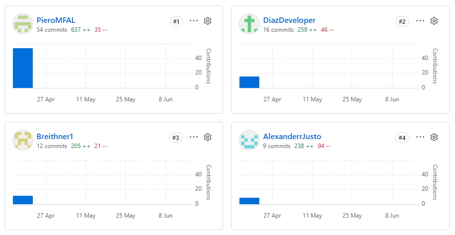

  
    

  
Universidad Peruana de Ciencias Aplicadas 
  Carrera de Ingeniería de Software

   

  

    <strong>1ASI0729</strong> 
    <strong>Desarrollo de Aplicaciones Open Source</strong>
  

  

    NRC 
    <strong>10155</strong>
  

  <h3><strong>Informe del Trabajo Final</strong></h3>

  

    Docente 
    <strong>Mori Paiva, Hugo Allan</strong>
  

  

    Equipo 
    <strong>Devo-PE</strong>
  

  

    Proyecto 
    <strong>InstAlert</strong>
  

  
<strong>Integrantes</strong>

  <table style="border: none; border-collapse: collapse; margin: 0 auto;">
    <tr style="border: none;">
      <td style="border: none; padding: 3px 15px;"><strong>Código</strong></td>
      <td style="border: none; padding: 3px 15px;"><strong>Apellidos y Nombres</strong></td>
    </tr>
    <tr style="border: none;">
      <td style="border: none; padding: 3px 15px;">u202415638</td>
      <td style="border: none; padding: 3px 15px;">Diaz Mendoza, Sebastian Victor Andre</td>
    </tr>
    <tr style="border: none;">
      <td style="border: none; padding: 3px 15px;">u202323319</td>
      <td style="border: none; padding: 3px 15px;">Janampa Gutierrez, Jhoan Darner</td>
    </tr>
    <tr style="border: none;">
      <td style="border: none; padding: 3px 15px;">u201610857</td>
      <td style="border: none; padding: 3px 15px;">Molina Falcón, Piero Leonardo</td>
    </tr>
    <tr style="border: none;">
      <td style="border: none; padding: 3px 15px;">u202418577</td>
      <td style="border: none; padding: 3px 15px;">Perez Encarnación, Breithner Rodolfo</td>
    </tr>
  </table>
    

  

    <strong>Período 2026-10</strong>  
    <strong>Junio de 2026</strong>
  

# Registro de versiones del informe
<table border="1" cellspacing="0" cellpadding="5">
<thead>
  <tr>
    <th>Versión</th>
    <th>Fecha</th>
    <th>Autor/es</th>
    <th>Descripción</th>
  </tr>
</thead>
<tbody>
  <tr>
    <td align="center">1.0 (AV1)</td>
    <td align="center">19/04/2026</td>
    <td>
      - Diaz Mendoza, Sebastian Victor Andre 
      - Janampa Gutierrez, Jhoan Darner 
      - Justo Yauricasa, Alexander Paolo 
      - Molina Falcón, Piero Leonardo 
      - Perez Encarnación, Breithner Rodolfo
    </td>
    <td>
      Capítulo I: Introducción 
      Capítulo II: Requirements Elicitation &amp; Analysis 
      Capítulo III: Requirements Specification 
      Capítulo IV: Product Design 
      Capítulo V: Product Implementation, Validation &amp; Deployment
    </td>
  </tr>
  <tr>
    <td align="center">2.0 (TB1)</td>
    <td align="center">12/05/2026</td>
    <td>
      - Diaz Mendoza, Sebastian Victor Andre 
      - Janampa Gutierrez, Jhoan Darner 
      - Justo Yauricasa, Alexander Paolo 
      - Molina Falcón, Piero Leonardo 
      - Perez Encarnación, Breithner Rodolfo
    </td>
    <td>
      Correcciones de la AV1 
      Capítulo V: Product Implementation, Validation &amp; Deployment 
      Frontend de InstAlert
    </td>
  </tr>
  <tr>
    <td align="center">3.0 (AV2)</td>
    <td align="center">18/06/2026</td>
    <td>
      - Diaz Mendoza, Sebastian Victor Andre 
      - Janampa Gutierrez, Jhoan Darner 
      - Molina Falcón, Piero Leonardo 
      - Perez Encarnación, Breithner Rodolfo
    </td>
    <td>
      Capítulo V: Product Implementation, Validation &amp; Deployment 
      Sprint 3 
      Versión actualizada del Frontend 
      Versión actualizada de la Landing Page 
      Despliegue del Backend
    </td>
  </tr>
  <tr>
    <td align="center">4.0 (TB2)</td>
    <td align="center">07/07/2026</td>
    <td>
      - Diaz Mendoza, Sebastian Victor Andre 
      - Janampa Gutierrez, Jhoan Darner 
      - Justo Yauricasa, Alexander Paolo 
      - Molina Falcón, Piero Leonardo 
      - Perez Encarnación, Breithner Rodolfo
    </td>
    <td>
      Capítulo V: Product Implementation, Validation &amp; Deployment 
      Sprint 4 
      Conexión entre Backend y Frontend 
      Correcciones del AV2
    </td>
  </tr>
</tbody>
</table>

## Project Report Collaboration Insights

Repositorio donde está el Project Report: [https://github.com/instalert-startup/instalert-project-report](https://github.com/instalert-startup/instalert-project-report)

Para la elaboración del informe, el equipo utilizó GitHub como plataforma principal de colaboración y control de versiones. El repositorio del Project Report permitió centralizar la documentación del proyecto, facilitando el trabajo colaborativo entre los integrantes y el seguimiento de los avances realizados durante cada entrega académica.

En esta versión (AV2), el informe fue actualizado para incluir los avances correspondientes al Sprint 3, las mejoras implementadas en el Frontend de InstAlert, las actualizaciones realizadas en la Landing Page y el despliegue del Backend. Asimismo, se incorporaron las evidencias de desarrollo, validación y documentación requeridas para reflejar el progreso alcanzado durante esta etapa del proyecto.

La colaboración entre los integrantes se realizó mediante commits, ramas de trabajo y actualizaciones continuas del repositorio, permitiendo mantener un historial detallado de cambios y una adecuada trazabilidad de las contribuciones realizadas por cada miembro del equipo.

### Figure AV2. Team Contributions in the Project Report Repository

*Figure AV2. Contributions of team members in the InstAlert Project Report repository.*

# Contenido

- [CAPÍTULO I: INTRODUCCIÓN](docs/capitulo1.md#capítulo-i-introducción)
  - [1.1. Startup Profile](docs/capitulo1.md#11-startup-profile)
    - [1.1.1. Descripción de la Startup](docs/capitulo1.md#111-descripción-de-la-startup)
    - [1.1.2. Perfiles de integrantes del equipo](docs/capitulo1.md#112-perfiles-de-integrantes-del-equipo)
  - [1.2. Solution Profile](docs/capitulo1.md#12-solution-profile)
    - [1.2.1. Antecedentes y problemática](docs/capitulo1.md#121-antecedentes-y-problemática)
    - [1.2.2. Lean UX Process](docs/capitulo1.md#122-lean-ux-process)
      - [1.2.2.1. Lean UX Problem Statements](docs/capitulo1.md#1221-lean-ux-problem-statements)
      - [1.2.2.2. Lean UX Assumptions](docs/capitulo1.md#1222-lean-ux-assumptions)
      - [1.2.2.3. Lean UX Hypothesis Statements](docs/capitulo1.md#1223-lean-ux-hypothesis-statements)
      - [1.2.2.4. Lean UX Canvas](docs/capitulo1.md#1224-lean-ux-canvas)
  - [1.3. Segmentos objetivo](docs/capitulo1.md#13-segmentos-objetivo)
- [CAPÍTULO II: REQUIREMENTS ELICITATION & ANALYSIS](docs/capitulo2.md#capítulo-ii-requirements-elicitation--analysis)
  - [2.1. Competidores](docs/capitulo2.md#21-competidores)
    - [2.1.1. Análisis Competitivo](docs/capitulo2.md#211-análisis-competitivo)
    - [2.1.2. Estrategias y tácticas frente a competidores](docs/capitulo2.md#212-estrategias-y-tácticas-frente-a-competidores)
  - [2.2. Entrevistas](docs/capitulo2.md#22-entrevistas)
    - [2.2.1. Diseño de entrevistas](docs/capitulo2.md#221-diseño-de-entrevistas)
    - [2.2.2. Registro de entrevistas](docs/capitulo2.md#222-registro-de-entrevistas)
    - [2.2.3. Análisis de entrevistas](docs/capitulo2.md#223-análisis-de-entrevistas)
  - [2.3. Needfinding](docs/capitulo2.md#23-needfinding)
    - [2.3.1. User Personas](docs/capitulo2.md#231-user-personas)
    - [2.3.2. User Task Matrix](docs/capitulo2.md#232-user-task-matrix)
    - [2.3.3. User Journey Mapping](docs/capitulo2.md#233-user-journey-mapping)
    - [2.3.4. Empathy Mapping](docs/capitulo2.md#234-empathy-mapping)
  - [2.4. Big Picture Event Storming](docs/capitulo2.md#24-big-picture-event-storming)
    - [2.4.1. Etapas del Big Picture Event Storming](docs/capitulo2.md#241-etapas-del-big-picture-event-storming)
      - [2.4.1.1. Generación de Eventos de Dominio](docs/capitulo2.md#2411-generación-de-eventos-de-dominio)
      - [2.4.1.2. Ordenamiento Cronológico y Flujo de Trabajo](docs/capitulo2.md#2412-ordenamiento-cronológico-y-flujo-de-trabajo)
      - [2.4.1.3. Identificación de Actores y Sistemas Externos](docs/capitulo2.md#2413-identificación-de-actores-y-sistemas-externos)
      - [2.4.1.4. Storytelling y Validación](docs/capitulo2.md#2414-storytelling-y-validación)
  - [2.5. Ubiquitous Language](docs/capitulo2.md#25-ubiquitous-language)
- [CAPÍTULO III: REQUIREMENTS SPECIFICATION](docs/capitulo3.md#capítulo-iii-requirements-specification)
  - [3.1. User Stories](docs/capitulo3.md#31-user-stories)
  - [3.2. Impact Mapping](docs/capitulo3.md#32-impact-mapping)
  - [3.3. Product Backlog](docs/capitulo3.md#33-product-backlog)
- [CAPÍTULO IV: PRODUCT DESIGN](docs/capitulo4.md#capítulo-iv-product-design)
  - [4.1. Style Guidelines](docs/capitulo4.md#41-style-guidelines)
    - [4.1.1. General Style Guidelines](docs/capitulo4.md#411-general-style-guidelines)
      - [4.1.1.1. Tipografía](docs/capitulo4.md#4111-tipografía)
      - [4.1.1.2. Colores](docs/capitulo4.md#4112-colores)
      - [4.1.1.3. Espaciado](docs/capitulo4.md#4113-espaciado)
      - [4.1.1.4. Iconografía](docs/capitulo4.md#4114-iconografía)
      - [4.1.1.5. Tono de Comunicación y Lenguaje Aplicado](docs/capitulo4.md#4115-tono-de-comunicación-y-lenguaje-aplicado)
    - [4.1.2. Web Style Guidelines](docs/capitulo4.md#412-web-style-guidelines)
  - [4.2. Information Architecture](docs/capitulo4.md#42-information-architecture)
    - [4.2.1. Organization Systems](docs/capitulo4.md#421-organization-systems)
    - [4.2.2. Labeling Systems](docs/capitulo4.md#422-labeling-systems)
    - [4.2.3. SEO Tags and Meta Tags](docs/capitulo4.md#423-seo-tags-and-meta-tags)
    - [4.2.4. Searching Systems](docs/capitulo4.md#424-searching-systems)
    - [4.2.5. Navigation Systems](docs/capitulo4.md#425-navigation-systems)
  - [4.3. Landing Page UI Design](docs/capitulo4.md#43-landing-page-ui-design)
    - [4.3.1. Landing Page Wireframe](docs/capitulo4.md#431-landing-page-wireframe)
    - [4.3.2. Landing Page Mock-up](docs/capitulo4.md#432-landing-page-mock-up)
  - [4.4. Web Applications UX/UI Design](docs/capitulo4.md#44-web-applications-uxui-design)
    - [4.4.1. Web Applications Wireframes](docs/capitulo4.md#441-web-applications-wireframes)
    - [4.4.2. Web Applications Wireflow Diagrams](docs/capitulo4.md#442-web-applications-wireflow-diagrams)
    - [4.4.3. Web Applications User Flow Diagrams](docs/capitulo4.md#443-web-applications-user-flow-diagrams)
  - [4.5. Web Applications Prototyping](docs/capitulo4.md#45-web-applications-prototyping)
  - [4.6. Domain-Driven Software Architecture](docs/capitulo4.md#46-domain-driven-software-architecture)
    - [4.6.1. Design-Level Event Storming](docs/capitulo4.md#461-design-level-event-storming)
    - [4.6.2. Software Architecture Context Diagram](docs/capitulo4.md#462-software-architecture-context-diagram)
    - [4.6.3. Software Architecture Container Diagrams](docs/capitulo4.md#463-software-architecture-container-diagrams)
    - [4.6.4. Software Architecture Components Diagrams](docs/capitulo4.md#464-software-architecture-components-diagrams)
  - [4.7. Software Object-Oriented Design](docs/capitulo4.md#47-software-object-oriented-design)
    - [4.7.1. Class Diagrams](docs/capitulo4.md#471-class-diagrams)
  - [4.8. Database Design](docs/capitulo4.md#48-database-design)
    - [4.8.1. Database Diagrams](docs/capitulo4.md#481-database-diagrams)
- [CAPÍTULO V: PRODUCT IMPLEMENTATION, VALIDATION & DEPLOYMENT](docs/capitulo5.md#capítulo-v-product-implementation-validation--deployment)
  - [5.1. Software Configuration Management](docs/capitulo5.md#51-software-configuration-management)
    - [5.1.1. Software Development Environment Configuration](docs/capitulo5.md#511-software-development-environment-configuration)
    - [5.1.2. Source Code Management](docs/capitulo5.md#512-source-code-management)
    - [5.1.3. Source Code Style Guide & Conventions](docs/capitulo5.md#513-source-code-style-guide--conventions)
    - [5.1.4. Software Deployment Configuration](docs/capitulo5.md#514-software-deployment-configuration)
  - [5.2. Landing Page, Services & Applications Implementation](docs/capitulo5.md#52-landing-page-services--applications-implementation)
    - [5.2.1. Sprint 1](docs/capitulo5.md#521-sprint-1)
      - [5.2.1.1. Sprint Planning 1](docs/capitulo5.md#5211-sprint-planning-1)
      - [5.2.1.2. Aspect Leaders and Collaborators](docs/capitulo5.md#5212-aspect-leaders-and-collaborators)
      - [5.2.1.3. Sprint Backlog 1](docs/capitulo5.md#5213-sprint-backlog-1)
      - [5.2.1.4. Development Evidence for Sprint Review](docs/capitulo5.md#5214-development-evidence-for-sprint-review)
      - [5.2.1.5. Execution Evidence for Sprint Review](docs/capitulo5.md#5215-execution-evidence-for-sprint-review)
      - [5.2.1.6. Services Documentation Evidence for Sprint Review](docs/capitulo5.md#5216-services-documentation-evidence-for-sprint-review)
      - [5.2.1.7. Software Deployment Evidence for Sprint Review](docs/capitulo5.md#5217-software-deployment-evidence-for-sprint-review)
      - [5.2.1.8. Team Collaboration Insights during Sprint](docs/capitulo5.md#5218-team-collaboration-insights-during-sprint)
    - [5.2.2. Sprint 2](docs/capitulo5.md#522-sprint-2)
      - [5.2.2.1. Sprint Planning 2](docs/capitulo5.md#5221-sprint-planning-2)
      - [5.2.2.2. Aspect Leaders and Collaborators](docs/capitulo5.md#5222-aspect-leaders-and-collaborators)
      - [5.2.2.3. Sprint Backlog 2](docs/capitulo5.md#5223-sprint-backlog-2)
      - [5.2.2.4. Development Evidence for Sprint Review](docs/capitulo5.md#5224-development-evidence-for-sprint-review)
      - [5.2.2.5. Execution Evidence for Sprint Review](docs/capitulo5.md#5225-execution-evidence-for-sprint-review)
      - [5.2.2.6. Services Documentation Evidence for Sprint Review](docs/capitulo5.md#5226-services-documentation-evidence-for-sprint-review)
      - [5.2.2.7. Software Deployment Evidence for Sprint Review](docs/capitulo5.md#5227-software-deployment-evidence-for-sprint-review)
      - [5.2.2.8. Team Collaboration Insights during Sprint](docs/capitulo5.md#5228-team-collaboration-insights-during-sprint)
    - [5.2.3. Sprint 3](docs/capitulo5.md#523-sprint-3)
      - [5.2.3.1. Sprint Planning 3.](docs/capitulo5.md#5231-sprint-planning-3)
      - [5.2.3.2. Aspect Leaders and Collaborators.](docs/capitulo5.md#5232-aspect-leaders-and-collaborators)
      - [5.2.3.3. Sprint Backlog 3.](docs/capitulo5.md#5233-sprint-backlog-3)
      - [5.2.3.4. Development Evidence for Sprint Review.](docs/capitulo5.md#5234-development-evidence-for-sprint-review)
      - [5.2.3.5. Execution Evidence for Sprint Review.](docs/capitulo5.md#5235-execution-evidence-for-sprint-review)
      - [5.2.3.6. Services Documentation Evidence for Sprint Review.](docs/capitulo5.md#5236-services-documentation-evidence-for-sprint-review)
      - [5.2.3.7. Software Deployment Evidence for Sprint Review.](docs/capitulo5.md#5237-software-deployment-evidence-for-sprint-review)
      - [5.2.3.8. Team Collaboration Insights during Sprint.](docs/capitulo5.md#5238-team-collaboration-insights-during-sprint)
    - [5.2.4. Sprint 4](docs/capitulo5.md#524-sprint-4)
      - [5.2.4.1. Sprint Planning 4.](docs/capitulo5.md#5241-sprint-planning-4)
      - [5.2.4.2. Aspect Leaders and Collaborators.](docs/capitulo5.md#5242-aspect-leaders-and-collaborators)
      - [5.2.4.3. Sprint Backlog 4.](docs/capitulo5.md#5243-sprint-backlog-4)
      - [5.2.4.4. Development Evidence for Sprint Review.](docs/capitulo5.md#5244-development-evidence-for-sprint-review)
      - [5.2.4.5. Execution Evidence for Sprint Review.](docs/capitulo5.md#5245-execution-evidence-for-sprint-review)
      - [5.2.4.6. Services Documentation Evidence for Sprint Review.](docs/capitulo5.md#5246-services-documentation-evidence-for-sprint-review)
      - [5.2.4.7. Software Deployment Evidence for Sprint Review.](docs/capitulo5.md#5247-software-deployment-evidence-for-sprint-review)
      - [5.2.4.8. Team Collaboration Insights during Sprint.](docs/capitulo5.md#5248-team-collaboration-insights-during-sprint)
  - [5.3. Validation Interviews.](docs/capitulo5.md#53-validation-interviews)
    - [5.3.1. Diseño de Entrevistas.](docs/capitulo5.md#531-diseño-de-entrevistas)
    - [5.3.2. Registro de Entrevistas.](docs/capitulo5.md#532-registro-de-entrevistas)
    - [5.3.3. Evaluaciones según heurísticas.](docs/capitulo5.md#533-evaluaciones-según-heurísticas)
  - [5.4. Video About-the-Product.](docs/capitulo5.md#54-video-about-the-product)
- [Conclusiones y Recomendaciones](docs/conclusiones.md#conclusiones-y-recomendaciones)
- [Bibliografía](docs/bibliografia.md#bibliografía)
- [Anexos](docs/anexos.md#anexos)

# STUDENT OUTCOME

**ABET – EAC - Student Outcome 3:** Capacidad de comunicarse efectivamente con un rango de audiencias.

<table border="1" cellspacing="0" cellpadding="5">
<thead>
<tr>
<th>Criterio específico</th>
<th>Acciones realizadas</th>
<th>Conclusiones</th>
</tr>
</thead>
<tbody>
<tr>
<td valign="top">Comunica oralmente sus ideas y/o resultados con objetividad a público de diferentes especialidades y niveles jerárquicos, en el marco del desarrollo de un proyecto en ingeniería.</td>
<td valign="top"><strong>Diaz Mendoza, Sebastian Victor Andre</strong> <strong>AV1:</strong> Participé en la presentación de la propuesta de InstAlert, explicando los objetivos del proyecto y las funcionalidades principales de la solución.  <strong>TB1:</strong> Sustenté los avances relacionados con el bounded context de Emergencies, explicando sus funcionalidades y su integración dentro de la arquitectura del sistema.  <strong>AV2:</strong> Participé en la presentación de las funcionalidades implementadas durante el Sprint 3 y en la validación de la solución desplegada.  <strong>TB2:</strong> Sustenté la integración del Bounded Context de Emergencies y expuse la resolución de observaciones de entregas anteriores ante el equipo evaluador.  <strong>Janampa Gutierrez, Jhoan Darner</strong> <strong>AV1:</strong> Participé en la exposición de los requerimientos y funcionalidades principales del sistema.  <strong>TB1:</strong> Sustenté el bounded context de Profile, explicando la gestión de perfiles y la interacción de los usuarios con la plataforma.  <strong>AV2:</strong> Expliqué el proceso de despliegue de la solución y las configuraciones realizadas para la publicación del sistema.  <strong>TB2:</strong> Expuse la configuración del entorno de producción en Railway (CORS, variables) y demostré la integración del Login/Register y el Panel de Admin con el backend real.  <strong>Molina Falcón, Piero Leonardo</strong> <strong>AV1:</strong> Expliqué la arquitectura general del proyecto y la organización de los componentes de InstAlert.  <strong>TB1:</strong> Sustenté el bounded context de Incidents, explicando la implementación de la gestión de incidentes y su integración con el resto del sistema.  <strong>AV2:</strong> Participé en la presentación de la integración entre frontend y backend, así como en la validación de los servicios desplegados.  <strong>TB2:</strong> Expliqué la integración final del Bounded Context de Incidents y comuniqué al equipo las correcciones estructurales aplicadas al reporte.  <strong>Perez Encarnación, Breithner Rodolfo</strong> <strong>AV1:</strong> Participé en la presentación de la propuesta de solución y en la validación de los requerimientos del proyecto.  <strong>TB1:</strong> Sustenté el bounded context de Communities, explicando las funcionalidades relacionadas con la interacción entre usuarios dentro de la plataforma.  <strong>AV2:</strong> Participé en la demostración de las funcionalidades implementadas durante el Sprint 3 y en la evaluación de los resultados obtenidos.  <strong>TB2:</strong> Sustenté las modificaciones aplicadas al Bounded Context de Communities y demostré la conexión exitosa entre el frontend y el backend.</td>
<td valign="top"><strong>AV1:</strong> La comunicación constante entre los integrantes permitió alinear la visión del proyecto y establecer objetivos claros para el desarrollo de InstAlert.  <strong>TB1:</strong> La sustentación de los distintos bounded contexts permitió que todos los miembros comprendieran la arquitectura y las responsabilidades de cada módulo del sistema.  <strong>AV2:</strong> La presentación de la solución integrada y desplegada evidenció la capacidad del equipo para comunicar resultados técnicos a diferentes tipos de audiencia.  <strong>TB2:</strong> La exposición de la integración final y el despliegue en la nube demostró la capacidad del equipo para explicar de forma clara la resolución de problemas técnicos complejos y el funcionamiento del ecosistema Full-Stack.</td>
</tr>
<tr>
<td valign="top">Comunica en forma escrita ideas y/o resultados con objetividad a público de diferentes especialidades y niveles jerárquicos, en el marco del desarrollo de un proyecto en ingeniería.</td>
<td valign="top"><strong>Diaz Mendoza, Sebastian Victor Andre</strong> <strong>AV1:</strong> Participé en la elaboración y revisión de la documentación inicial del proyecto, contribuyendo a la descripción de los objetivos y funcionalidades de InstAlert.  <strong>TB1:</strong> Documenté aspectos relacionados con el bounded context de Emergencies y colaboré en la actualización del repositorio del proyecto.  <strong>AV2:</strong> Participé en la actualización del informe final y en la documentación de las funcionalidades implementadas durante el Sprint 3.  <strong>TB2:</strong> Documenté el desarrollo e integración en la rama fix/emergencies y redacté el apartado del Sprint 5 en el informe del proyecto, subsanando entregas anteriores.  <strong>Janampa Gutierrez, Jhoan Darner</strong> <strong>AV1:</strong> Colaboré en la elaboración de la documentación de requerimientos y características principales del sistema.  <strong>TB1:</strong> Documenté los componentes relacionados con el bounded context de Profile y sus interacciones dentro de la plataforma.  <strong>AV2:</strong> Elaboré documentación relacionada con el despliegue de la solución y la configuración de los servicios utilizados.  <strong>TB2:</strong> Documenté las variables de entorno, la correcta configuración de CORS y registré los avances de integración del Panel de Admin y las cuentas de usuario.  <strong>Molina Falcón, Piero Leonardo</strong> <strong>AV1:</strong> Participé en la redacción y revisión de la documentación técnica del proyecto.  <strong>TB1:</strong> Documenté el bounded context de Incidents, incluyendo diagramas, modelos y componentes relacionados con su implementación.  <strong>AV2:</strong> Colaboré en la actualización del informe técnico y la documentación de la integración entre frontend y backend.  <strong>TB2:</strong> Documenté el proceso de conexión de Incidents y redacté las correcciones necesarias para refinar el reporte final del proyecto.  <strong>Perez Encarnación, Breithner Rodolfo</strong> <strong>AV1:</strong> Participé en la elaboración de la documentación general del proyecto y en la revisión de los entregables.  <strong>TB1:</strong> Documenté el bounded context de Communities y colaboré en la organización de los artefactos técnicos del sistema.  <strong>AV2:</strong> Participé en la actualización de la documentación final del proyecto y en el registro de las funcionalidades desarrolladas durante el Sprint 3.  <strong>TB2:</strong> Registré los cambios en el código de Communities tanto en frontend como en backend, documentando la verificación de su integración.</td>
<td valign="top"><strong>AV1:</strong> La documentación compartida permitió establecer una visión común del proyecto y facilitar la comunicación entre los integrantes del equipo.  <strong>TB1:</strong> La documentación de los bounded contexts mejoró la comprensión de la arquitectura y favoreció la trazabilidad de las decisiones técnicas.  <strong>AV2:</strong> La actualización continua del informe y de los repositorios permitió comunicar de forma clara y organizada los resultados alcanzados durante el desarrollo de InstAlert.  <strong>TB2:</strong> El registro detallado de los commits de integración y la corrección del informe final garantizaron la entrega de una documentación técnica coherente, estructurada y de nivel profesional.</td>
</tr>
</tbody>
</table>

