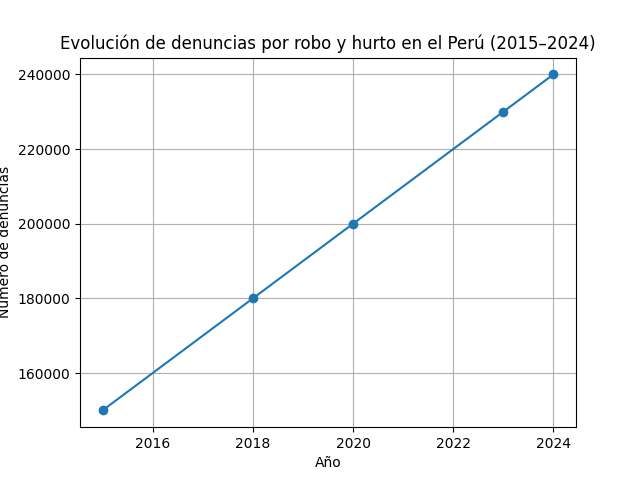
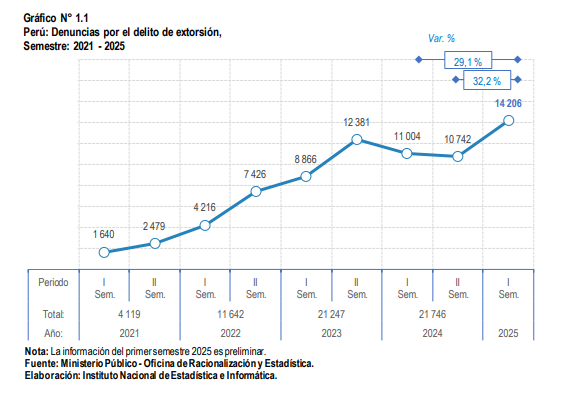

# Capítulo I: Introducción

## 1.1 Startup Profile

### 1.1.1 Descripción de la Startup

La startup InstAlert nace como una propuesta tecnológica enfocada en mejorar la seguridad en entornos urbanos con altos niveles de riesgo. Su objetivo principal es brindar a los ciudadanos una herramienta digital que les permita anticiparse a situaciones peligrosas y actuar de manera rápida y eficiente.
La solución consiste en una aplicación web que integra diversas funcionalidades orientadas a la seguridad, tales como un sistema de alertas de emergencia, reportes generados por la comunidad, visualización de zonas de riesgo mediante mapas interactivos y canales de comunicación entre usuarios.
El valor diferencial de la propuesta radica en centralizar, dentro de una sola plataforma, tanto mecanismos de prevención como de reacción. Esto permite que el usuario no solo esté informado sobre su entorno, sino que también pueda responder de forma inmediata ante situaciones de riesgo, incluso en contextos de alta presión.
Asimismo, la aplicación busca fomentar la colaboración entre ciudadanos y entidades locales, promoviendo una red de apoyo que contribuya a mejorar la seguridad colectiva.

### 1.1.2 Perfiles de integrantes del equipo

El equipo está conformado por estudiantes de Ingeniería de Software con habilidades complementarias en desarrollo, diseño y gestión de proyectos, lo que permite abordar de manera integral la creación de la solución tecnológica propuesta.

Integrante 1:
Nombre: Piero Leonardo Molina Falcón

Código de estudiante: U201610857
Carrera: Ingeniería de software 
Descripción: Estudiante de Ingeniería de Software con formación en desarrollo de aplicaciones web, UI/UX, base de datos, conocimientos en programación, estructuras de datos y diseño de sistemas/software. Cuenta con comprensión de arquitecturas de software, desarrollo en el área backend y frontend. Destaca por la capacidad de análisis, pensamiento lógico y disposición para el aprendizaje continuo en entornos tecnológicos.
Aporte al equipo: He participado en la definición del proyecto, la elaboración del Capítulo I del informe y la estructuración del Lean UX Process. Además, he contribuido en la organización del equipo, asegurando el avance del proyecto de manera coordinada.

Integrante 2:
Nombre: Sebastian Victor Andre Diaz Mendoza

Código de estudiante: u202415638
Carrera: Ingeniería de software 
Descripción: Soy Sebastian Diaz, actualmente estudio la carrera de ingenieria de software y para el presente proyecto me he enfocado en diseño de experiencia de usuario (UX/UI), además soy responsable de la interacción y usabilidad. Cuento con dominio en estructura de datos, algoritmos y base de datos. Con una capacidad de razonamiento lógico y ordenado, con conocimiento en paradigmas como la programación orientada a objetos y técnicas de aplicación en la complejidad algorítmica.
Aporte al equipo: Aporte en la presentación de idea y fundamento del proyecto además de desarrollo en los capítulo II y IV. Con alta proactividad en el desarrollo del proyecto

Integrante 3:
Nombre: Alexander Paolo Justo Yauricasa

Código de estudiante: u20191c054
Carrera: Ingeniería de software 
Descripción: Soy Alexander Justo, estudiante de Ingeniería de Software. En este proyecto me he enfocado en parte de los HUs y Product Backlog. Poseo conocimientos en estructuras de datos, algoritmos y bases de datos, además de una sólida capacidad de razonamiento lógico y organizado. Asimismo, manejo paradigmas como la programación orientada a objetos y aplico técnicas relacionadas con la complejidad algorítmica.
Aporte al equipo: He participado en la definición del proyecto, en la redacción del Capítulo III, parte del los HUs y Product Backlog. Además, ha aportado en la organización del equipo y en la asignación de tareas.

Integrante 4:
Nombre: Breithner Rodolfo Perez Encarnación 

Código de estudiante: u202418577
Carrera: Ingeniería de software
Descripción:Soy Breithner Rodolfo Perez Encarnación, estudiante de Ingeniería de Software de 4to ciclo. En mis proyectos me he enfoncadao en los diseños del Web Applications Wireframes. Poseo conocimientos sólidos en bases de datos (SQL y MongoDB), estructuración de diagramas UML y documentación con Swagger, además de una fuerte orientación hacia el diseño de soluciones estructuradas. Asimismo, aplico buenas prácticas de desarrollo.
Aporte al equipo: He participado en el capitulo II en la parte de Empathy Maping, User Journey Mapping y en el Capitulo IV en la parte de anding Page Wireframe. y Web Applications Wireframes.

## 1.2 Solution Profile

### 1.2.1 Antecedentes y problemática

La inseguridad ciudadana es una problemática creciente que afecta tanto a residentes como a comerciantes en diversas zonas urbanas. Este fenómeno impacta directamente en la calidad de vida, la percepción de seguridad y el desarrollo de actividades económicas.
Para analizar esta situación de manera estructurada, se utiliza la metodología 5W2H, la cual permite identificar los aspectos clave del problema:

     What (¿Qué está ocurriendo?)
Se presenta una alta incidencia de delitos como robos, asaltos y actos de vandalismo en zonas urbanas consideradas de riesgo medio-alto, generando una constante sensación de inseguridad en los ciudadanos.

     Why (¿Por qué ocurre?)
Las principales causas del problema incluyen:
Falta de acceso a información en tiempo real sobre incidentes cercanos
Escasa comunicación entre vecinos y comerciantes
Limitada presencia o respuesta de las autoridades
Ausencia de herramientas tecnológicas integradas

     Who (¿A quién afecta?)
Residentes en zonas con alta percepción de inseguridad
Comerciantes expuestos a robos o vandalismo

     Where (¿Dónde ocurre?)
Zonas urbanas de riesgo medio-alto
Calles con poca iluminación
Áreas con baja presencia policial

     When (¿Cuándo ocurre?)
Horarios nocturnos
Momentos de baja afluencia
Situaciones sin vigilancia

     How (¿Cómo ocurre?)
Los delitos se producen aprovechando:
Falta de información preventiva
Desorganización comunitaria
Ausencia de alertas inmediatas

    How much (¿Cuánto impacto tiene?)
La magnitud de la inseguridad ciudadana en el Perú se refleja en el incremento sostenido de delitos contra el patrimonio, como robos y hurtos.

Según el Sistema Nacional de Seguridad Ciudadana (SINASEC), las denuncias pasaron de aproximadamente 150 mil en 2015 a más de 230 mil en 2023, superando las 240 mil en 2024. Esta tendencia continúa en aumento en 2025, especialmente en zonas urbanas densamente pobladas.
Además, más del 80 % de la población urbana percibe un incremento en la inseguridad, lo que evidencia un impacto no solo económico, sino también psicológico y social.

Conclusión del análisis 5W2H: 
Del análisis realizado, se concluye que la inseguridad ciudadana en zonas urbanas de riesgo medio-alto no solo responde a la alta incidencia de delitos, sino también a la falta de acceso a información en tiempo real, la limitada comunicación entre los ciudadanos y la ausencia de herramientas tecnológicas que integren mecanismos de prevención y respuesta.
Esta situación incrementa la vulnerabilidad de los usuarios, quienes se ven obligados a modificar su comportamiento cotidiano para evitar riesgos. En este contexto, se identifica la oportunidad de desarrollar una solución tecnológica que permita mejorar la capacidad de reacción, fomentar la colaboración comunitaria y proporcionar información oportuna para la toma de decisiones en situaciones de peligro.

Enunciado del problema

Actualmente, los ciudadanos y comerciantes en zonas urbanas de riesgo medio-alto no cuentan con una herramienta tecnológica integrada que les permita acceder a información en tiempo real sobre incidentes, alertar a otros usuarios y reaccionar de manera oportuna ante situaciones de inseguridad, lo que incrementa su vulnerabilidad y limita su capacidad de prevención.
Objetivos del proyecto
Objetivo general
Desarrollar una aplicación web que permita mejorar la seguridad ciudadana mediante el acceso a información en tiempo real, generación de alertas y colaboración comunitaria.
Objetivos específicos
Permitir a los usuarios reportar incidentes de manera rápida
Visualizar zonas de riesgo mediante mapas interactivos
Facilitar la comunicación entre usuarios en situaciones de emergencia
Proporcionar alertas en tiempo real
Restricciones del proyecto
El sistema dependerá de la participación activa de los usuarios
Limitaciones en la precisión de la geolocalización
Acceso restringido a datos oficiales en tiempo real
Tiempo de desarrollo limitado al ciclo académico
Recursos técnicos y humanos acotados

### 1.2.2 Lean UX Process

#### 1.2.2.1 Lean UX Problem Statements

En esta sección se analiza el problema desde el enfoque Lean UX, identificando el dominio, los segmentos de clientes, los puntos de dolor y la oportunidad de solución, con el objetivo de definir una propuesta de valor clara para el desarrollo del producto.

Domain (Dominio del problema)
El dominio del problema corresponde a la seguridad ciudadana en entornos urbanos, específicamente en zonas con niveles de riesgo medio-alto donde los ciudadanos están expuestos a delitos como robos y asaltos.

Customer Segments (Segmentos de clientes)
Ciudadanos que transitan frecuentemente por zonas de riesgo
Comerciantes con negocios en áreas vulnerables
Personas que buscan herramientas para mejorar su seguridad personal

Pain Points (Puntos de dolor)
Falta de información en tiempo real sobre incidentes cercanos
Imposibilidad de reaccionar rápidamente ante situaciones de peligro
Ausencia de comunicación efectiva entre vecinos
Sensación constante de inseguridad

Gap (Brecha identificada)
Actualmente, no existe una herramienta digital integrada que permita a los usuarios prevenir, reportar y reaccionar ante situaciones de inseguridad en tiempo real, combinando información, comunicación y acción inmediata en una sola plataforma.

Vision / Strategy (Visión del producto)
InstAlert busca convertirse en una plataforma web que centralice la información de seguridad ciudadana, permita la colaboración entre usuarios y facilite la reacción inmediata ante incidentes, mediante funcionalidades como alertas en tiempo real, reportes comunitarios y visualización de zonas de riesgo.

Initial Segment (Segmento inicial)
El enfoque inicial estará dirigido a ciudadanos y comerciantes de zonas urbanas de riesgo medio-alto, especialmente aquellos que dependen de su movilidad diaria y requieren mayor seguridad en sus desplazamientos.

Problem Statement (Pregunta de diseño)
¿Cómo podríamos brindar a vecinos y comerciantes de zonas de riesgo medio-alto una forma rápida, accesible y efectiva de prevenir, reportar y reaccionar ante situaciones de inseguridad?

#### 1.2.2.2 Lean UX Assumptions

En el enfoque Lean UX, las assumptions (suposiciones) representan hipótesis iniciales sobre los usuarios, sus necesidades, comportamientos y el valor que ofrece la solución. Estas suposiciones deben ser validadas posteriormente mediante pruebas con usuarios, prototipos y retroalimentación continua.
A continuación, se presentan las principales suposiciones identificadas para el desarrollo de la solución InstAlert:
1. Suposiciones sobre los usuarios
Los usuarios desean sentirse más seguros durante sus desplazamientos diarios.
Los usuarios valoran herramientas simples, rápidas e intuitivas, especialmente en situaciones de estrés.
Los usuarios utilizan frecuentemente dispositivos móviles para acceder a información en tiempo real.
Los usuarios están dispuestos a colaborar con su comunidad reportando incidentes.
2. Suposiciones sobre el problema
La falta de información en tiempo real incrementa la vulnerabilidad de los ciudadanos.
La ausencia de comunicación efectiva entre vecinos limita la prevención de delitos.
Los usuarios no cuentan con herramientas tecnológicas integradas para reaccionar ante emergencias.
Las soluciones actuales son fragmentadas y poco eficientes.
3. Suposiciones sobre la solución
Una aplicación web centralizada mejorará la capacidad de respuesta ante situaciones de riesgo.
La incorporación de un botón de pánico permitirá una reacción inmediata.
Un sistema de reportes colaborativos mejorará la información disponible sobre incidentes.
La visualización de zonas de riesgo ayudará a los usuarios a tomar mejores decisiones.
4. Suposiciones sobre el valor del producto
Los usuarios percibirán valor en una plataforma que mejore su seguridad personal.
La rapidez y facilidad de uso serán factores clave para la adopción.
La colaboración comunitaria será un elemento diferenciador frente a otras soluciones.
5. Suposiciones sobre el negocio
Existe una creciente demanda de soluciones tecnológicas enfocadas en seguridad ciudadana.
El producto puede escalar a diferentes ciudades con problemáticas similares.
Se pueden generar alianzas con entidades locales o comunidades vecinales.

Conclusión de las assumptions
Estas suposiciones guían el desarrollo inicial del producto InstAlert y permiten identificar los principales riesgos del proyecto. No obstante, deberán ser validadas mediante pruebas con usuarios reales, prototipos y experimentación continua, siguiendo los principios del enfoque Lean UX.

#### 1.2.2.3 Lean UX Hypothesis Statements. 

A continuación, se presentan las hipótesis del proyecto InstAlert, formuladas bajo el enfoque Lean UX, con el objetivo de validar las decisiones de diseño mediante métricas medibles.

Hipótesis 1: Botón de pánico
Creemos que:
 Construir un botón de pánico accesible y de rápida activación
Para:
 Usuarios que se encuentran en situaciones de riesgo en zonas urbanas
Lograremos:
 Una reacción inmediata ante situaciones de peligro y una mayor probabilidad de recibir ayuda oportuna
Sabremos que hemos tenido éxito cuando veamos:
Que el botón se active en menos de 3 segundos
Que el usuario complete la acción en 1 intento

Hipótesis 2: Mapa de calor
Creemos que:
 Incorporar un sistema de mapas de calor con información actualizada sobre incidentes
Para:
 Usuarios que necesitan identificar zonas peligrosas en sus desplazamientos
Lograremos:
 Que los usuarios tomen decisiones más seguras al movilizarse
Sabremos que hemos tenido éxito cuando veamos:
Que al menos el 60% de los usuarios consulte el mapa antes de desplazarse
Que el 50% de los usuarios modifique su ruta tras visualizar zonas de riesgo

Hipótesis 3: Reportes comunitarios
Creemos que:
 Habilitar un sistema de reportes comunitarios en tiempo real
Para:
 Vecinos y comerciantes que desean compartir información relevante
Lograremos:
 Incrementar la colaboración entre usuarios y mejorar la información disponible
Sabremos que hemos tenido éxito cuando veamos:
Que se generen al menos 50 reportes semanales en zonas piloto
Que el 40% de los reportes sean validados por otros usuarios

Hipótesis 4: Notificaciones en tiempo real
Creemos que:
 Implementar notificaciones en tiempo real sobre incidentes cercanos
Para:
 Usuarios que necesitan mantenerse informados sobre su entorno
Lograremos:
 Una reacción preventiva ante posibles amenazas
Sabremos que hemos tenido éxito cuando veamos:
Que al menos el 65% de los usuarios interactúe con las alertas
Que el 70% de los usuarios visualice la alerta en menos de 5 segundos

Hipótesis 5: Interfaz intuitiva
Creemos que:
 Diseñar una interfaz simple e intuitiva
Para:
 Usuarios en situaciones de estrés o urgencia
Lograremos:
 Reducir la fricción en el uso de la aplicación en momentos críticos
Sabremos que hemos tenido éxito cuando veamos:
Que el 80% de los usuarios complete acciones clave en menos de 10 segundos

#### 1.2.2.4 Lean UX Canvas

El Lean UX Canvas presentado a continuación sintetiza los principales elementos del modelo de negocio y la propuesta de valor de la solución InstAlert. En este se integran el problema identificado, los segmentos de usuarios, los puntos de dolor, las soluciones propuestas, las hipótesis, las suposiciones y los resultados esperados, permitiendo visualizar de manera estructurada la relación entre las necesidades del usuario y las funcionalidades del producto. Este canvas sirve como base para la validación continua del proyecto mediante la experimentación y el enfoque iterativo propio de Lean UX.

  

 A continuación, se presenta el Lean UX Canvas del proyecto (ver enlace):
 
[Ver Lean UX Canvas completo en Canva](https://canva.link/w0jiztdn8dpluhr)

## 1.3 Segmentos objetivo

Los segmentos presentados en esta sección se derivan del análisis realizado en el Lean UX Process, donde se identificaron los principales grupos de usuarios afectados por la problemática. A continuación, se detallan sus características demográficas, geográficas y comportamentales, así como información estadística relevante que sustenta la necesidad de la solución propuesta.

Segmento 1: Residentes en zonas de riesgo medio-alto
Descripción:
 Personas que viven en zonas urbanas con niveles de inseguridad medio-alto y que buscan herramientas que les permitan sentirse más seguros en su entorno cotidiano.
Características demográficas:
Edad: 18 – 50 años
Sexo: Masculino y femenino
Nivel socioeconómico: B y C
Ocupación: Estudiantes, trabajadores dependientes e independientes
Características geográficas:
Ubicación: Zonas urbanas
Regiones: Lima Metropolitana y principales ciudades del Perú
Características psicográficas:
Uso constante de dispositivos móviles
Preocupación por la seguridad personal
Interés en prevenir riesgos
Valoración de la tecnología como herramienta de apoyo
Sustento estadístico:
 Según el INEI, más del 80% de la población urbana percibe un incremento en la inseguridad ciudadana, lo que evidencia una alta demanda de soluciones orientadas a mejorar la seguridad personal.
 
Segmento 2: Comerciantes en zonas de riesgo medio-alto
Descripción:
 Personas que trabajan o poseen negocios en zonas con alta incidencia delictiva y requieren herramientas que les permitan proteger sus bienes y reaccionar ante situaciones de riesgo.
Características demográficas:
Edad: 20 – 55 años
Sexo: Masculino y femenino
Nivel socioeconómico: C y D
Ocupación: Dueños de negocios, emprendedores
Características geográficas:
Ubicación: Zonas urbanas y periféricas
Regiones: Lima, Arequipa, Trujillo, entre otras
Características psicográficas:
Exposición constante a posibles robos
Necesidad de respuesta inmediata
Interés en proteger su inversión
Valoración de herramientas colaborativas
Sustento estadístico:
 De acuerdo con el Ministerio Público y el INEI, los delitos contra el patrimonio, como robos, hurtos y extorsión, han mostrado un incremento sostenido en los últimos años, afectando principalmente a pequeños negocios en zonas urbanas.

A continuación, se presentan datos estadísticos que evidencian la magnitud de la problemática de inseguridad ciudadana en el Perú, la cual impacta directamente en los segmentos identificados.

  

Figura 1. Evolución de denuncias por robo y hurto en el Perú (2015–2024).
Fuente: Elaboración propia a partir de datos del Instituto Nacional de Estadística e Informática (INEI, 2024)
Como se observa en el gráfico, las denuncias por delitos contra el patrimonio han mostrado un incremento sostenido en los últimos años, lo que evidencia la creciente problemática de inseguridad en el país. Esta tendencia justifica la necesidad de desarrollar soluciones tecnológicas que permitan mejorar la prevención y la capacidad de reacción ante situaciones de riesgo.

  

Figura 2. Denuncias por el delito de extorsión en el Perú (2021–2025).
Fuente: Ministerio Público – Oficina de Racionalización y Estadística; Instituto Nacional de Estadística e Informática (INEI, 2025).
Como se observa en el gráfico, las denuncias por el delito de extorsión en el Perú han mostrado una tendencia creciente en los últimos años. Este incremento evidencia la persistencia y evolución de la criminalidad en el país, afectando tanto a ciudadanos como a comerciantes. Esta situación refuerza la necesidad de desarrollar soluciones tecnológicas que permitan mejorar la prevención y la capacidad de reacción ante situaciones de inseguridad.

