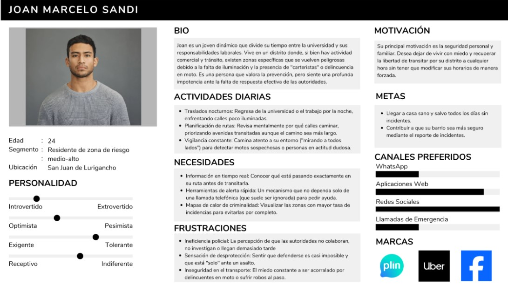

# Capítulo II: Requirements Elicitation & Analysis

## 2.1. Competidores

### Competidor 1: Aplicaciones Municipales de Seguridad

* **Descripción:** Plataformas móviles gestionadas por gobiernos locales que permiten a los vecinos reportar emergencias, delitos y problemas urbanos directamente a las autoridades. Su disponibilidad está sujeta a los distritos afiliados.
* **Ventaja Competitiva:** Enlace oficial e inmediato con los sistemas de respuesta rápida del distrito (serenazgo) y respaldo de la municipalidad.
* **Público Objetivo:** Residentes de los distritos que cuentan con el servicio, especialmente en áreas con alta necesidad de seguridad.
* **Estrategia de Marketing:** Promoción mediante canales oficiales de la municipalidad, redes sociales institucionales y asambleas vecinales.
* **Funciones Principales:** Reportes directos a autoridades, atención de emergencias médicas y, en algunos casos, acceso a cámaras de videovigilancia.
* **Modelo de Costos:** Totalmente gratuito para el ciudadano (el municipio asume la inversión).
* **Distribución:** Descarga en tiendas de aplicaciones y promoción en portales web municipales.

### Competidor 2: CODISEC (Comité Distrital de Seguridad Ciudadana)

* **Descripción:** No es una aplicación comercial, sino un organismo estatal que articula los esfuerzos de la Policía Nacional, municipios, fiscalía y ciudadanos para gestionar la seguridad local.
* **Ventaja Competitiva:** Total respaldo gubernamental, capacidad para ejecutar políticas públicas y un enfoque de coordinación multisectorial.
* **Público Objetivo:** Instituciones del Estado, gobiernos locales y ciudadanos que participan activamente en juntas vecinales.
* **Estrategia de Marketing:** Comunicación a través de medios estatales, campañas de prevención y eventos de participación comunitaria.
* **Funciones Principales:** Creación de planes de seguridad distrital, organización de vecinos y coordinación entre diferentes autoridades.
* **Modelo de Costos:** Servicio público sin costo, sustentado por el presupuesto del Estado.
* **Distribución:** Operación a través de dependencias gubernamentales y oficinas municipales.

### Competidor 3: Life360

* **Descripción:** Reconocida aplicación global orientada a la seguridad personal y familiar. Permite rastrear la ubicación de un grupo cerrado en tiempo real y cuenta con herramientas de emergencia automatizadas.
* **Ventaja Competitiva:** Ecosistema tecnológico robusto, alcance internacional, interfaz intuitiva y funciones de alto valor como la detección automática de accidentes vehiculares.
* **Público Objetivo:** Familias que monitorean a sus miembros (hijos o personas mayores), grupos de viaje y comunidades que buscan visibilidad constante de su entorno.
* **Estrategia de Marketing:** Sólido posicionamiento digital (SEO/ASO), campañas masivas en redes sociales y colaboraciones con influencers enfocados en seguridad y familia.
* **Funciones Principales:** Geolocalización en vivo, alertas por geocercas (llegadas y salidas), botón de pánico silencioso (SOS) y registro del historial de rutas.
* **Modelo de Costos:** Formato Freemium. Funciones básicas gratuitas y planes de suscripción de pago (aprox. $4.99/mes) para características avanzadas.
* **Distribución:** Altamente posicionada en Google Play y App Store, además de su plataforma web.

### 2.1.1 Análisis Competitivo

**¿Por qué realizar este análisis?**

Analizar a la competencia permite identificar sus estrategias, fortalezas y debilidades, lo que ayuda a **InstAlert** a desarrollar mejores tácticas de marketing y de negocio. El objetivo es diferenciarse y competir de manera más efectiva en el mercado, detectando oportunidades de innovación y anticipando posibles amenazas del entorno para asegurar una propuesta de valor única.

| Categoría | Atributo | InstAlert | Seguridad ciudadana App | CODISEC Perú | Life360 |
| :--- | :--- | :--- | :--- | :--- | :--- |
| | **Nombre** | **InstAlert** | **Seguridad ciudadana App** | **CODISEC Perú** | **Life360** |
| | **Logotipo** | 

 | 

 | 

 | 

 |
| **Perfil** | **Overview** | Plataforma web de seguridad ciudadana diseñada para residentes y comerciantes en zonas de alta vulnerabilidad. Su valor central radica en la respuesta inmediata mediante la activación de alertas de pánico, la visualización de mapas de calor interactivos alimentados por la comunidad y el acceso a datos oficiales. | Solución tecnológica orientada al modelo B2G (Business to Government) que permite a las municipalidades digitalizar la gestión de seguridad. Se especializa en la integración de botones de pánico institucionales y sistemas de reporte ciudadano con soporte técnico continuo. | Entidad articuladora del Estado peruano (SINASEC) encargada de la planificación y supervisión de políticas de seguridad distrital. Su enfoque es la gestión pública multisectorial, coordinando a la Policía Nacional, Serenazgo y juntas vecinales. | Ecosistema global de geolocalización y seguridad personal enfocado en el ámbito familiar. Su propuesta se centra en el monitoreo preventivo mediante “círculos” de confianza, notificaciones de movimiento y funciones avanzadas de auxilio SOS. |
| | **Ventaja Competitiva** | Unifica funciones dispersas (pánico, prevención visual y validación comunitaria). Destaca por su integración con dispositivos periféricos IoT y un sistema de notificaciones híbrido vinculado a red de apoyo y autoridades. | Especialización en gestión pública (PEI/POI) con implementación rápida "llave en mano". Garantiza estabilidad en un entorno de plataforma cerrada sin requerir infraestructura propia por parte del municipio contratante. | Respaldo institucional y marco legal (Ley N° 27933). Posee autoridad única para centralizar datos oficiales sobre criminalidad y la capacidad de movilizar recursos públicos y patrullaje integrado. | Estándar global en seguridad familiar con infraestructura de rastreo madura. Ofrece servicios premium que trascienden la seguridad personal, incluyendo protección de identidad y asistencia vehicular. |
| **Plan de Marketing** | **Mercado Objetivo** | Residentes urbanos, familias, jóvenes y adultos en zonas de riesgo, nuevos residentes y organizaciones (condominios/empresas) interesadas en seguridad local. | Gobiernos locales, municipalidades distritales y provinciales que requieren digitalizar su gestión de seguridad ciudadana bajo un modelo institucional (B2G). | La comunidad organizada y población general dentro de una jurisdicción. Enfocado en gestión territorial de seguridad y articulación vecinal-autoridad. | Círculos familiares interesados en la geolocalización preventiva de integrantes (niños, adultos mayores) y grupos que buscan visibilidad en tiempo real. |
| | **Estrategias de Marketing** | Campañas digitales basadas en testimonios reales, convenios con municipalidades y aseguradoras, y alianzas con brigadas vecinales para integrarse en redes comunitarias. | Enfoque institucional resaltando valor político y cumplimiento de metas municipales. Marketing directo B2G a través de licitaciones y exposición de métricas de respuesta. | Comunicación institucional vía municipalidades, consultas públicas, actas de reunión y eventos comunitarios con juntas vecinales. | Liderazgo en SEO/ASO en tiendas de aplicaciones, marketing masivo en redes sociales y colaboraciones con medios sobre historias de éxito en seguridad familiar. |
| **Plan de Producto** | **Productos y Servicios** | Botón de pánico multicanal, mapa de calor dinámico, historial de incidentes, alertas inteligentes de proximidad e integración con dispositivos IoT externos. | Alerta inmediata vinculada a serenazgo/policía, mapa de calor institucional y administración municipal de datos con soporte técnico 24/7. | Plan Distrital de Seguridad Ciudadana, capacitación de juntas vecinales, patrullaje integrado y transparencia de resultados en consultas públicas. | Geolocalización en tiempo real, alertas de llegada/salida, detección de accidentes de tránsito, botón SOS silencioso e historial de ubicaciones. |
| | **Precios y Costos** | Modelo **Freemium**: Funciones básicas gratuitas. Plan Premium de bajo costo para notificación directa a autoridades e integración IoT avanzada. | Modelo **SaaS institucional**: Pago por licencia anual. El costo se determina por la densidad poblacional y el rango de la contratación pública. | **Gratuito**: Servicio financiado íntegramente con presupuesto municipal y recursos del Estado peruano. | Modelo **Freemium**: Versión básica gratuita. Planes Premium desde $4.99/mes que incluyen asistencia avanzada y soporte de emergencia. |
| | **Canales de Distribución** | **Exclusivamente Web (PWA)**: Página web oficial optimizada para escritorio y móvil, redes sociales y ferias comunitarias de seguridad. | Web oficial para soporte y App móvil personalizada bajo el nombre del municipio en Google Play y App Store. | Sesiones presenciales, portales municipales oficiales y comunicación directa con organizaciones vecinales. | Presencia masiva en Google Play y App Store, sitio web oficial y campañas con influencers enfocados en seguridad parental. |
| **Análisis SWOT** | **Fortalezas** | Integración sinérgica de prevención y reacción inmediata. Interfaz intuitiva y rápida para el ciudadano con validación comunitaria de reportes. | Especialización en el sector público y cumplimiento de metas POI/PEI. Implementación ágil (20-25 días) y soporte técnico 24/7. | Robustez institucional y autoridad para centralizar datos oficiales. Capacidad de movilizar patrullaje integrado y recursos estatales. | Liderazgo global y reconocimiento de marca. Ecosistema tecnológico maduro con detección de accidentes y alianzas internacionales. |
| | **Oportunidades** | Crecimiento rápido sin burocracia estatal. Alianzas con aseguradoras y condominios. Tendencia global hacia soluciones comunitarias e IoT. | Alta demanda de digitalización municipal. Posibilidad de estandarizar la seguridad distrital y expandirse a nivel nacional. | Expansión mediante convenios llave en mano para municipios pequeños. Uso de analítica predictiva para fortalecer la confianza institucional. | Expansión en mercados con alta inseguridad (Latam). Sinergias con operadoras móviles e integración de IA para predicción de riesgos. |
| | **Debilidades** | Bajo reconocimiento de marca inicial. Dependencia crítica de la adopción masiva y colaboración comunitaria para la efectividad de la data. | Dependencia total del proveedor (plataforma cerrada). Acceso limitado solo a través de contratos estatales sin contacto directo con el ciudadano. | Carece de métricas de impacto públicas. Interfaz institucional que puede no ser intuitiva en situaciones de emergencia crítica. | Enfoque limitado a la seguridad familiar (no ciudadana/delictiva). Alto consumo de batería y funciones avanzadas bloqueadas tras pago. |
| | **Amenazas** | Competidores establecidos en seguridad privada. Riesgo de reportes falsos que afecten la credibilidad y desafíos regulatorios de datos. | Cambios en la gestión política o recortes presupuestarios. Competencia de aplicaciones municipales gratuitas de gran escala. | Desconfianza ciudadana en la respuesta de las autoridades locales. Riesgo de saturación del sistema por falsas alarmas ciudadanas. | Regulaciones de privacidad de datos cada vez más estrictas. Competencia indirecta de herramientas gratuitas de geolocalización básica. |

### 2.1.2 Estrategias y tácticas frente a competidores

En base al análisis previo, **InstAlert** establece las siguientes directrices estratégicas para diferenciarse y consolidar su posición frente a los actores clave del sector:

#### **Frente a Seguridad Ciudadana App (Enfoque Institucional)**
* **Acceso Democrático:** A diferencia del modelo B2G que depende de la gestión municipal, nuestra plataforma elimina la burocracia, permitiendo que cualquier ciudadano acceda al servicio de forma directa e inmediata.
* **Inteligencia Híbrida de Datos:** Superamos la limitación de los reportes exclusivamente oficiales al integrar una capa de validación ciudadana en tiempo real, optimizada con filtros de seguridad para garantizar la veracidad de la información.
* **Innovación en Activación:** Mientras la competencia se limita a interfaces móviles estándar, nosotros implementamos tecnología IoT para permitir alertas bajo coacción y activaciones externas, maximizando la seguridad del usuario.
* **Red de Respuesta Integral:** Hemos evolucionado el modelo de notificación; no solo alertamos a las autoridades oficiales, sino que activamos una red de apoyo simultánea compuesta por contactos de confianza y brigadas vecinales.
* **Diseño Centrado en la Crisis:** Priorizamos una UX/UI minimalista y de alta velocidad, eliminando protocolos complejos para que la respuesta ante una emergencia sea lo más intuitiva posible.
* **Modelo de Negocio Ágil:** Nuestro esquema *freemium* facilita la adopción masiva orgánica, posicionándonos como un aliado estratégico para aseguradoras y condominios, más allá del sector estatal.

#### **Frente a CODISEC Perú (Enfoque Gubernamental)**
* **Inmediatez Operativa:** Transformamos la planificación burocrática y las reuniones periódicas de CODISEC en una herramienta de acción instantánea que pone la capacidad de reporte en la mano del ciudadano.
* **Dinamismo del Riesgo:** Actuamos como un radar de seguridad vivo que actualiza el panorama delictivo minuto a minuto, superando los reportes estáticos y los planes de seguridad de largo plazo.
* **Puente Digital Directo:** Cerramos la brecha de comunicación entre el Estado y el vecino, sirviendo como el canal digital que faltaba para articular la respuesta de serenazgo y policía con la red privada del afectado.
* **Empoderamiento y Autonomía:** Ofrecemos al ciudadano herramientas de defensa digital autónomas (como el botón de pánico silencioso) que no dependen de la compleja coordinación entre múltiples entidades públicas para activarse.
* **Cercanía y Confianza:** Nos posicionamos como una solución ágil y amigable que complementa el ecosistema del SINASEC, eliminando la percepción de rigidez institucional y fomentando la confianza a través de la transparencia.

#### **Frente a Life360 (Enfoque Familiar)**
* **Especialización Ciudadana:** Mientras Life360 se enfoca en el monitoreo del círculo familiar, InstAlert se especializa en el combate a la inseguridad del entorno urbano, enfrentando riesgos externos como el robo y el vandalismo vecinal.
* **Contextualización de Zonas de Riesgo:** Vamos más allá de la ubicación compartida; proporcionamos mapas de calor preventivos que permiten al usuario evitar áreas peligrosas basándose en la actividad delictiva reciente.
* **Accesibilidad Crítica:** Bajo nuestro modelo de impacto social, aseguramos que las funciones de emergencia sean gratuitas y universales, a diferencia del modelo de suscripción global que limita funciones vitales tras muros de pago.
* **Adaptación Regional:** InstAlert nace del contexto latinoamericano, integrando flujos de comunicación específicos con serenazgos y brigadas vecinales, algo que las plataformas globales no logran tropicalizar con efectividad.
* **Cultura Colaborativa:** Cambiamos el rol del usuario de un monitor pasivo de su familia a un agente activo de su comunidad, creando un ecosistema de prevención colectiva que beneficia a todo el vecindario y no solo a un grupo privado.

### 2.2. Entrevistas

#### 2.2.1. Diseño de entrevistas

| Sección | Preguntas de la Entrevista |
| :--- | :--- |
| **Introducción** | 1. ¿Podría proporcionar sus nombres y apellidos? 2. ¿Qué edad tiene actualmente? 3. ¿En qué distrito reside usted? |
| **Preguntas para Segmento 1: Vecinos de zonas de riesgo medio-alto** | 1. ¿En qué circunstancias o momentos específicos experimenta mayor inseguridad al transitar por su zona de residencia? ¿Cuál es su percepción de seguridad durante sus desplazamientos cotidianos? 2. ¿Qué medidas preventivas adopta actualmente para desplazarse de forma segura en su localidad? ¿De qué manera estas estrategias de movilidad han llegado a afectarle en algún aspecto? 3. ¿Podría describir alguna situación de riesgo en su zona donde se le dificultó reaccionar o solicitar auxilio? En caso de no haberlo vivido personalmente, ¿tiene conocimiento de algún incidente cercano? ¿Qué factores considera que complicaron la respuesta de los afectados? 4. ¿De qué forma garantiza su protección personal ante la presencia de riesgos en la vía pública o en su vecindario? 5. Si tuviera acceso a una herramienta de asistencia para situaciones de riesgo en su comunidad, ¿bajo qué funciones esperaría que esta le brinde soporte? 6. ¿Qué obstáculos o deficiencias identifica en los canales de solicitud de ayuda disponibles ante una emergencia? 7. ¿A través de qué medios se informa habitualmente sobre los sucesos de inseguridad ocurridos en su sector? 8. ¿Ha percibido, mediante experiencias propias o eventos observados, alguna falta de fiabilidad en las autoridades correspondientes? 9. Ante una situación de vulnerabilidad, ¿considera que un botón de pánico sería una herramienta eficaz? De ser así, ¿cuál sería el aporte específico de este mecanismo? 10. ¿Cree que disponer de datos precisos sobre las áreas con mayor índice de criminalidad en su zona le resultaría beneficioso? 11. ¿Considera de utilidad contar con reportes actualizados sobre incidentes recientes? En caso afirmativo, ¿cuál sería el motivo? 12. ¿Qué información específica y detallada requeriría usted en cada reporte de incidente? 13. Si existiera la posibilidad de incluir una descripción que permita identificar al responsable en el reporte, ¿considera que esto le sería de ayuda? ¿De qué manera? 14. ¿Cuentan los residentes con un canal de comunicación definido para reportar y alertar sobre diversas situaciones de interés comunitario? 15. ¿Forma usted parte de juntas de vecinos o redes de apoyo enfocadas en la seguridad ciudadana? 16. ¿Qué acciones o proyectos considera que la comunidad de vecinos podría ejecutar para optimizar la seguridad del entorno? |
| **Preguntas para Segmento 2: Comerciantes en zonas de riesgo medio-alto** | 1. ¿Ha experimentado en algún momento una sensación de inseguridad durante el desempeño de sus labores? De ser así, ¿cuáles fueron los motivos? 2. En su operatividad diaria, ¿en qué escenarios específicos identifica una mayor vulnerabilidad dentro de su establecimiento (apertura, cierre, gestión de efectivo o periodos de soledad)? 3. ¿Recuerda alguna circunstancia en la que la integridad de su negocio se viera comprometida y no contara con una capacidad de respuesta inmediata? ¿Podría describir el suceso? 4. ¿Con qué periodicidad y qué tan actuales son los hechos delictivos registrados en este sector? 5. ¿Qué modalidades delictivas considera que afectan con mayor frecuencia al sector comercial de esta zona? 6. ¿Ha repercutido el estado de la seguridad ciudadana en el rendimiento operativo o financiero de su empresa? En caso afirmativo, ¿de qué forma? 7. Además de los robos o asaltos, ¿existen otros agentes o factores que le generen una percepción de riesgo? 8. ¿Considera que el contacto con las fuerzas del orden o la solicitud de auxilio es accesible en su localidad? De lo contrario, ¿qué elementos dificultan este proceso? 9. ¿Estima usted que las autoridades asignadas a su jurisdicción son dignas de confianza? ¿Cuáles son los fundamentos de su postura?  10. ¿Considera que la implementación de un botón de pánico resultaría de utilidad para su protección? 11. ¿Bajo qué supuestos de riesgo proyectaría usted el uso de un botón de pánico (por ejemplo: tentativa de hurto, clientes hostiles, extorsión o sospecha de seguimiento)? 12. ¿Estima que esta herramienta optimizaría la asistencia de las autoridades si permitiera el envío de alertas directas a las unidades más cercanas? 13. ¿Cree que disponer de información exacta sobre los puntos críticos de incidencia delictiva en su zona le sería de ayuda? 14. ¿Qué datos técnicos o descriptivos desearía recibir acerca de dichos incidentes? |

#### 2.2.2. Registro de entrevistas

### Entrevistas realizadas al Segmento 1: Residentes en zonas de riesgo medio-alto

**Entrevista 1**
* **Entrevistado:** Luis Acuña
* **Edad:** 24 años | **Distrito:** Villa el Salvador | **Duración:** 07:30
* **Evidencia:** 

* **Link de grabación:** [Ver en Google Drive](https://drive.google.com/file/d/1YYbLXw05sbvAsS6NOetuvwhimf2buhcz/view?usp=sharing)
* **Nota:** El inicio efectivo de la entrevista se da en el minuto 00:00:32.

**Entrevista 2**
* **Entrevistado:** Ignacio Baulety
* **Edad:** 27 años | **Distrito:** Ate | **Duración:** 13:41
* **Testimonio clave:** *"El entrevistado indica que vive con frecuencia inestabilidad emocional debido a la inseguridad en la que vive cada vez que sale de casa a estudiar, trabajar o hacer deporte."*
* **Evidencia:** 

* **Link de grabación:** [Ver en SharePoint](https://upcedupe-my.sharepoint.com/personal/u201610857_upc_edu_pe/_layouts/15/stream.aspx?id=%2Fpersonal%2Fu201610857%5Fupc%5Fedu%5Fpe%2FDocuments%2FEntrevista%2FEntrevistaSource%2EMOV&referrer=StreamWebApp%2EWeb&referrerScenario=AddressBarCopied%2Eview%2Eee25deb5%2Df3d0%2D449e%2Dad52%2Dfdd0f9d7167b)

**Entrevista 3**
* **Entrevistado:** Renzo Baldeon
* **Edad:** 26 años | **Distrito:** Callao | **Duración:** 08:30
* **Evidencia:** 

* **Link de grabación:** [Ver en Google Drive](https://drive.google.com/file/d/1J6zfexhuCn5Op4AMSNH5LDKwullAqQiD/view?usp=sharing)

---

### Entrevistas realizadas al Segmento 2: Comerciantes en zonas de riesgo medio-alto

**Entrevista 4**
* **Entrevistado:** Maria Rocio de los Ángeles
* **Edad:** 42 años | **Distrito:** Comas | **Duración:** 18:06
* **Evidencia:** 

* **Link de grabación:** [Ver en Google Drive](https://drive.google.com/drive/folders/1UhCP09qC8tN4AUiRxbhMkTz6jt3saF_-?usp=sharing)

### 2.2.3. Análisis de entrevistas

#### **Segmento 1: Residentes en zonas de riesgo medio-alto**

**Entrevista 1 (Luis Acuña):**
El entrevistado experimenta una mayor sensación de inseguridad durante las horas nocturnas y en zonas desoladas. Esta percepción lo obliga a adoptar medidas preventivas que restringen significativamente su libertad personal, tales como ocultar objetos de valor y limitar sus rutas habituales. Ante la respuesta tardía de las autoridades y la carencia de canales formales de auxilio, Luis depende de redes sociales y grupos vecinales informales para mantenerse alerta. Para mitigar esta vulnerabilidad, considera indispensable una herramienta tecnológica que integre un botón de pánico, envío de ubicación en tiempo real y mapas con reportes detallados. Subraya que la tecnología debe complementarse con una mejor organización vecinal, instalación de cámaras y mayor iluminación.

**Entrevista 2 (Ignacio Baulety):**
Ignacio manifiesta experimentar con frecuencia una inestabilidad emocional derivada de la inseguridad en su entorno, afectando sus rutinas básicas de estudio, trabajo y deporte. Esta situación se agrava por la nula organización vecinal y la escasa presencia policial en su zona, factores que incrementan su sensación de desprotección. Como estrategia de autoprotección, ha desarrollado una rutina que limita sus desplazamientos a horarios de alta circulación y rutas por avenidas principales o zonas comerciales. El análisis de su testimonio revela que la percepción de peligro no solo afecta su tranquilidad psicológica, sino que condiciona severamente su calidad de vida y libertad de movimiento.

**Entrevista 3 (Renzo Baldeon):**
Residente de la Provincia Constitucional del Callao, Renzo describe su zona como un entorno peligroso marcado por robos, vandalismo y altercados constantes. Habiendo sido víctima del hurto de su teléfono celular, destaca la ineficacia de la policía, cuya intervención fue de escasa ayuda. Aunque su comunidad cuenta con una red de apoyo vecinal para la instalación de cámaras y alarmas, reconoce que estos esfuerzos son insuficientes para cubrir la demanda de seguridad actual. El entrevistado enfatiza la necesidad de contar con una aplicación especializada que brinde soporte directo y efectivo en situaciones de riesgo para suplir las deficiencias de las autoridades.

---

#### **Segmento 2: Comerciantes en zonas de riesgo medio-alto**

**Entrevista 4 (Maria Rocio de los Ángeles):**
La experiencia de María en Comas revela el profundo impacto psicológico y económico que genera la delincuencia en el sector comercial. Identifica una vulnerabilidad crítica en horas de baja afluencia peatonal, donde la soledad de las calles incrementa el temor a ser asaltada sin recibir auxilio. Tras un intento de robo traumático, describe un entorno hostil de extorsiones y hurtos cíclicos que la han obligado a reducir su horario de atención, provocando una caída en sus ingresos. 

Manifiesta un escepticismo profundo hacia la policía y el serenazgo debido a la lentitud de sus intervenciones. Ante esto, propone un dispositivo de alerta inmediata (botón de pánico) y destaca la importancia de una base de datos comunitaria que registre métodos delictivos. Esta información no solo serviría para la organización preventiva de los vecinos, sino también como un mecanismo de presión para exigir resultados a las autoridades.

## 2.3. Needfinding.

### 2.3.1. User Personas

User persona Joan Marcelo - Residente de zona de riesgo medio-alto 

***Nota.*** Representa todo lo relacionado al user persona, motivaciones, frustraciones, datos personales, etc., pertenece al primer segmento.

User persona Maria Torres - Comerciante de zona de riesgo medio-alto

***Nota.*** Representa todo lo relacionado al user persona, motivaciones, frustraciones, datos personales, etc., pertenece al primer segmento.

### 2.3.2. User Task Matrix.

User Task Matrix: Residente de zona de riesgo medio-alto

| Tareas de Usuario | Frecuencia | Importancia |
| :--- | :---: | :---: |
| Registro y configuración de perfil | Low | High |
| Visualizar mapa de calor de incidentes | High | High |
| Consultar rutas seguras en tiempo real | High | High |
| Recibir alertas de zonas de riesgo próximas | High | High |
| Consultar historial de incidentes de la zona | High | Medium |
| Configurar contactos de confianza | Medium | High |
| Validar reportes de otros usuarios | Medium | Medium |
| Configurar notificaciones personalizadas | Medium | Low |
| Reportar robo o asalto presenciado | Medium | High |
| Coordinar acciones con vecinos | Medium | Medium |
| Activar botón de pánico (Emergencia) | Low | High |
| Solicitar asistencia de serenazgo/policía | Low | High |

User Task Matrix: Comerciantes en zonas de riesgo medio-alto

| Tareas de Usuario | Frecuencia | Importancia |
| :--- | :---: | :---: |
| Reportar estafa o billetes falsos | High | High |
| Reportar robo o asalto presenciado | High | High |
| Coordinar acciones con colegas/vecinos | High | High |
| Configurar contactos de confianza | High | High |
| Recibir alertas de zonas de riesgo próximas | High | High |
| Activar botón de pánico (Emergencia) | Medium | High |
| Validar reportes de otros usuarios | Medium | Medium |
| Solicitar asistencia de serenazgo/policía | Medium | High |
| Visualizar mapa de calor de incidentes | Medium | Medium |
| Configurar notificaciones personalizadas | Medium | Medium |
| Consultar historial de incidentes de la zona | Medium | Low |
| Registro y configuración de perfil | Low | High |
| Consultar rutas seguras en tiempo real | Low | Medium |

###2.3.3. User Journey Mapping

Primer Segmento: Residentes de zonas de riesgo medio-alto

Segundo segmento: Comerciantes en zonas de riesgo medio-alto)

### 2.3.4. Empathy Mapping.

Empathy Map Kiara Lluques

Empathy Map Luan Enrique

## 2.4. Big Picture Event Storming

El equipo llevó a cabo una sesión de Big Picture Event Storming con el objetivo de comprender el dominio del negocio de InstAlert de manera integral. Esta técnica colaborativa permitió mapear el flujo completo de la solución, desde la detección de una amenaza hasta la resolución del incidente, alineando la visión técnica con las necesidades de los segmentos de usuarios identificados (Residentes y Comerciantes). A través de este proceso, se logró una primera aproximación visual de alto nivel que permitió explorar el panorama del negocio, identificar procesos críticos y exponer potenciales problemas u oportunidades de mejora en la experiencia del usuario.

### 2.4.1 Etapas del Big Picture Event Storming

#### 2.4.1.1 Generación de Eventos de Dominio (Domain Events)

En esta fase inicial, el equipo se enfocó en identificar todos los hechos significativos que ocurren dentro del ecosistema de seguridad de InstAlert. Siguiendo la convención de la metodología, estos eventos se plasmaron en notas adhesivas de color naranja y se redactaron en tiempo pasado.
Se identificaron eventos clave como Incidente sospechoso detectado, Botón de pánico activado, Alerta de estafa emitida y Ubicación en tiempo real compartida. Esta etapa permitió visibilizar la complejidad de las interacciones sin restricciones de orden.

#### 2.4.1.2 Ordenamiento Cronológico y Flujo de Trabajo

Una vez generados los eventos, se procedió a organizarlos en una línea de tiempo de izquierda a derecha. Este ordenamiento permitió estructurar dos flujos principales de la aplicación: el Flujo Preventivo (orientado a la consulta de rutas y mapas de calor por parte del residente) y el Flujo Reactivo (enfocado en la respuesta inmediata ante emergencias para comerciantes y vecinos). Se utilizaron alineaciones verticales para representar acciones que ocurren en paralelo, como el envío simultáneo de notificaciones a serenazgo y contactos de confianza.

En esta etapa, el equipo organizó los eventos de dominio de manera cronológica, permitiendo identificar la secuencia de interacción desde que un usuario consulta el mapa de calor (prevención) hasta la activación del botón de pánico en situaciones críticas (reacción). Se establecieron dependencias lógicas donde los reportes comunitarios alimentan la inteligencia colectiva del sistema.

#### 2.4.1.3 Identificación de Actores y Sistemas Externos

Para otorgar contexto a los eventos, se añadieron capas de información identificando quién ejecuta las acciones y qué herramientas de terceros intervienen. Actores: Se definieron roles críticos como el Residente de zona de riesgo, el Comerciante, el Contacto de Confianza y el Operador de Serenazgo. Sistemas Externos: Se identificaron integraciones necesarias con Google Maps API para la geolocalización y Firebase para la gestión de notificaciones push en tiempo real.

#### 2.4.1.4 Storytelling y Validación (Reverse Storytelling)

Finalmente, el equipo realizó una lectura crítica del muro para verificar la coherencia del dominio. Al narrar la historia de forma inversa, se identificaron vacíos lógicos y se añadieron post-its de color rosado para marcar "Puntos de Dolor" o problemas, tales como la validación de reportes falsos y la conectividad en sótanos o zonas de baja señal. Esta etapa garantizó que el sistema propuesto sea robusto ante situaciones de estrés real.

## 2.5. Ubiquitous Language.

| Término (Inglés) | Definición |
| :--- | :--- |
| Resident user | Ciudadano o estudiante que vive o transita frecuentemente por zonas de riesgo medio-alto y utiliza la plataforma para su prevención y seguridad personal. |
| Merchant user | Comerciante que desarrolla sus actividades en áreas de riesgo medio-alto y requiere de una herramienta rápida para protegerse ante posibles robos o estafas. |
| IoT Panic Button | Dispositivo físico inteligente conectado a la aplicación que permite al usuario emitir alertas sonoras instantáneas y solicitar auxilio de manera discreta e inmediata. |
| Real-time alerts | Notificaciones enviadas de manera automática e inmediata a contactos de confianza y autoridades en el momento en que se activa una emergencia. |
| Crime Heat Map | Representación visual en la plataforma que destaca las áreas geográficas con mayor incidencia delictiva, basándose en datos históricos y reportes recientes. |
| Collaborative reports | Denuncias o avisos de incidentes (robos, agresiones, actividades sospechosas) generados por los usuarios, que pueden incluir evidencia en texto, foto o audio. |
| Trusted contacts | Lista de personas (familiares, amigos o vecinos) previamente configurada por el usuario, quienes recibirán la ubicación y alerta de auxilio en caso de emergencia. |
| Security Authorities | Fuerzas del orden (Policía Nacional, Serenazgo) con las que la plataforma busca integrarse y coordinar para agilizar la respuesta ante situaciones de peligro. |
| Risk zones | Áreas urbanas o rurales identificadas dentro de la plataforma que presentan un alto índice de inseguridad ciudadana. |
| Smart data analysis | Uso de Inteligencia Artificial para procesar el historial de reportes y datos actuales, permitiendo predecir patrones de delincuencia y mejorar la prevención ciudadana. |
