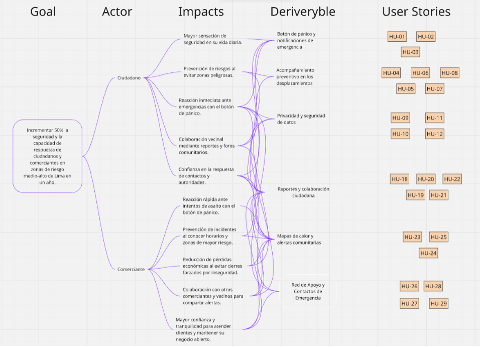

# Capítulo III: Requirements Specification
## 3.1.User Stories
### EP01	Gestión de Cuenta y Configuración  
############################################################

US01: Registro de usuario
  As cliente o comerciante,
  I quiero registrar mis datos,
  so que pueda ingresar a la aplicación y recibir notificaciones.

Acceptance Criteria

Scenario: Registro exitoso
- Given el usuario accede a la pantalla de registro
- When ingresa datos válidos y presiona "Registrarse"
- Then el sistema crea la cuenta
- And redirige al usuario

Scenario: Datos inválidos
- Given el usuario está en registro
- When ingresa datos incorrectos o correo duplicado
- Then el sistema muestra error
- And no permite continuar

############################################################

US02: Inicio de sesión
  As cliente o comerciante,
  I quiero iniciar sesión,
  so que pueda acceder a la aplicación.

Acceptance Criteria

Scenario: Inicio de sesión exitoso
- Given usuario en pantalla de inicio de sesión
- When ingresa credenciales correctas
- Then accede al sistema
- And es redirigido

Scenario: Error de inicio de sesión
- Given usuario en inicio de sesión
- When ingresa datos incorrectos
- Then sistema muestra error

############################################################

US03: Configuración de perfil
  As usuario,
  I quiero actualizar mi perfil,
  so que pueda mantener datos correctos.

Acceptance Criteria

Scenario: Actualización correcta
- Given usuario autenticado
- When edita datos válidos
- Then sistema guarda cambios

Scenario: Error de datos
- Given usuario en perfil
- When ingresa datos inválidos
- Then sistema muestra error

### EP02	Gestión de Alertas de Emergencia  

############################################################

US04: Envío de alerta de emergencia
  As usuario,
  I quiero enviar alerta,
  so que pueda notificar peligro.

Acceptance Criteria

Scenario: Envío exitoso
- Given usuario autenticado
- When presiona alerta
- Then sistema registra alerta
- And notifica usuarios

############################################################

US05: Geolocalización automática
  As usuario,
  I quiero enviar ubicación automática,
  so que pueda mejorar precisión.

Acceptance Criteria

Scenario: Ubicación capturada
- Given GPS activo
- When envía alerta
- Then sistema adjunta ubicación

############################################################

US06: Recepción de alertas cercanas
  As usuario,
  I quiero recibir alertas cercanas,
  so que pueda prevenir riesgos.

Acceptance Criteria

Scenario: Recepción en tiempo real
- Given notificaciones activas
- When ocurre alerta cercana
- Then sistema notifica usuario

############################################################

US07: Cancelación de alerta
  As usuario,
  I quiero cancelar alerta,
  so que pueda evitar confusión.

Acceptance Criteria

Scenario: Cancelación exitosa
- Given alerta enviada
- When usuario cancela
- Then sistema actualiza estado
- And notifica cancelación

############################################################

US08: Historial de alertas
  As usuario,
  I quiero ver historial,
  so que pueda revisar eventos.

Acceptance Criteria

Scenario: Visualización
- Given usuario autenticado
- When accede historial
- Then sistema muestra lista

### EP03	Reportes Comunitarios de Incidentes  

############################################################

US09: Crear reportes
  As usuario,
  I quiero reportar incidentes,
  so que pueda informar comunidad.

Acceptance Criteria

Scenario: Reporte exitoso
- Given usuario autenticado
- When envía reporte
- Then sistema registra y publica

############################################################

US10: Adjuntar evidencia
  As usuario,
  I quiero adjuntar imágenes o videos,
  so que pueda dar contexto.

Acceptance Criteria

Scenario: Adjuntar archivo
- Given usuario creando reporte
- When agrega archivo válido
- Then sistema lo guarda

############################################################

US11: Ver reportes en mapa
  As usuario,
  I quiero visualizar reportes en mapa,
  so que pueda identificar zonas.

Acceptance Criteria

Scenario: Mapa cargado
- Given usuario accede mapa
- When carga datos
- Then sistema muestra puntos

############################################################

US12: Filtro de reportes
  As usuario,
  I quiero filtrar reportes,
  so que pueda encontrar información.

Acceptance Criteria

Scenario: Filtro aplicado
- Given filtros disponibles
- When usuario selecciona filtros
- Then sistema muestra resultados

### EP04	Gestión del Landing Pague  

############################################################

US13: Descargar aplicación
  As visitante,
  I quiero descargar la aplicación,
  so que pueda usar el sistema.

Acceptance Criteria

Scenario: Redirección
- Given usuario en landing
- When hace clic en descargar
- Then redirige a la tienda

############################################################

US14: Ver información de plataforma
  As visitante,
  I quiero conocer la aplicación,
  so que pueda entender beneficios.

Acceptance Criteria

Scenario: Visualización
- Given usuario en landing
- When navega
- Then sistema muestra información

############################################################

US15: Registro desde landing
  As visitante,
  I quiero registrarme,
  so que pueda usar la aplicación rápido.

Acceptance Criteria

Scenario: Registro exitoso
- Given formulario visible
- When envía datos válidos
- Then sistema crea cuenta

############################################################

US16: Ver testimonios
  As visitante,
  I quiero ver experiencias,
  so que pueda confiar en la aplicación.

Acceptance Criteria

Scenario: Visualización
- Given sección de testimonios
- When usuario accede
- Then sistema muestra contenido

############################################################

US17: Suscripción
  As visitante,
  I quiero suscribirme,
  so que pueda recibir novedades.

Acceptance Criteria

Scenario: Suscripción exitosa
- Given formulario de suscripción
- When ingresa correo
- Then sistema registra

### EP05	Visualización de Zonas de Riesgo  

############################################################

US18: Ver zonas de riesgo
  As usuario,
  I quiero ver mapa de riesgo,
  so que pueda identificar peligros.

Acceptance Criteria

Scenario: Carga exitosa
- Given conexión activa
- When accede mapa
- Then muestra zonas

Scenario: Sin conexión
- Given sin internet
- When accede mapa
- Then muestra error

############################################################

US19: Filtrar zonas
  As usuario,
  I quiero filtrar zonas,
  so que pueda analizar mejor.

Acceptance Criteria

Scenario: Filtro aplicado
- Given filtro seleccionado
- When aplica filtro
- Then muestra resultados

Scenario: Sin resultados
- Given sin coincidencias
- When filtra
- Then muestra mensaje

############################################################

US20: Ver detalle de zona
  As usuario,
  I quiero ver detalles,
  so que pueda entender riesgos.

Acceptance Criteria

Scenario: Detalle mostrado
- Given zona seleccionada
- When consulta
- Then muestra información

Scenario: Error de carga
- Given falla del sistema
- When consulta
- Then muestra error

############################################################

US21: Buscar direcciones
  As usuario,
  I quiero buscar ubicaciones,
  so que pueda conocer riesgos.

Acceptance Criteria

Scenario: Resultado encontrado
- Given dirección válida
- When busca
- Then centra mapa

Scenario: No encontrado
- Given dirección inválida
- When busca
- Then muestra error

############################################################

US22: Reportar zonas oscuras
  As usuario,
  I quiero marcar zonas sin luz,
  so que pueda advertir a otros.

Acceptance Criteria

Scenario: Registro exitoso
- Given opción activa
- When marca punto
- Then sistema registra zona

Scenario: Visualización
- Given usuario en mapa
- When carga datos
- Then muestra advertencia

### EP06	Visualización de testimonios o casos de uso  

############################################################

US23: Recibir alertas cercanas
  As usuario,
  I quiero recibir alertas,
  so que pueda estar informado.

Acceptance Criteria

Scenario: Notificación recibida
- Given alerta cercana
- When ocurre
- Then sistema notifica

Scenario: Notificaciones desactivadas
- Given desactivadas
- When ocurre alerta
- Then no notifica

############################################################

US24: Configurar notificaciones
  As usuario,
  I quiero personalizar alertas,
  so que pueda evitar información innecesaria.

Acceptance Criteria

Scenario: Guardado exitoso
- Given configuración abierta
- When guarda cambios
- Then sistema aplica

Scenario: Error
- Given falla del sistema
- When guarda
- Then muestra error

############################################################

US25: Notificaciones comunitarias
  As usuario,
  I quiero recibir reportes,
  so que pueda informarme.

Acceptance Criteria

Scenario: Notificación relevante
- Given evento cercano
- When ocurre
- Then sistema notifica

Scenario: No relevante
- Given evento lejano
- When ocurre
- Then no notifica

### EP07	Red de Apoyo y Contactos de Emergencia   

############################################################

US26: Alertar contactos
  As usuario,
  I quiero alertar contactos,
  so que pueda pedir ayuda.

Acceptance Criteria

Scenario: Envío exitoso
- Given botón de emergencia
- When se activa
- Then envía ubicación

Scenario: Error de envío
- Given falla de red
- When envía
- Then muestra error

############################################################

US27: Solicitar ayuda cercana
  As usuario,
  I quiero pedir ayuda,
  so que pueda recibir asistencia.

Acceptance Criteria

Scenario: Envío exitoso
- Given usuarios cercanos
- When solicita ayuda
- Then reciben alerta

Scenario: Sin usuarios
- Given no hay usuarios
- When solicita
- Then sistema informa

############################################################

US28: Solicitar asistente rápido
  As usuario,
  I quiero enviar solicitud,
  so que pueda conectar con otros.

Acceptance Criteria

Scenario: Aceptación
- Given solicitud enviada
- When aceptan
- Then sistema conecta

Scenario: Rechazo
- Given solicitud
- When rechazan
- Then sistema elimina

############################################################

US29: Panel de monitoreo
  As contacto,
  I quiero ver ubicación en tiempo real,
  so que pueda ayudar al usuario.

Acceptance Criteria

Scenario: Acceso al panel
- Given recibe enlace
- When abre
- Then muestra mapa en tiempo real

Scenario: Sesión caducada
- Given tiempo excedido
- When accede
- Then sistema bloquea acceso

############################################################

## 3.2.Impact Mapping

## 3.3.Product Backlog

| Orden | User Story ID | Título | Descripción | Story Points |
|------|---------------|-------------|--------|--------------|
| 1 | HU13 | Descarga de la aplicación | Como visitante, quiero acceder a enlaces de descarga para instalar la aplicación en mi dispositivo. | 1 |
| 2 | HU14 | Visualización de información de la plataforma | Como visitante, quiero ver información clara sobre InstAlert para entender sus beneficios y funcionamiento. | 1 |
| 3 | HU15 | Registro desde la landing page | Como visitante, quiero registrarme directamente desde la landing page para comenzar a usar la aplicación rápidamente. | 3 |
| 4 | HU16 | Visualización de testimonios o casos de uso | Como visitante, quiero ver experiencias de otros usuarios para confiar en la efectividad de la plataforma. | 1 |
| 5 | HU17 | Suscripción a notificaciones o novedades | Como visitante, quiero suscribirme para recibir noticias o actualizaciones sobre la plataforma. | 2 |
| 6 | HU1 | Registro de usuario | Como cliente o comerciante quiero registrar mi mis datos para poder ingresar a la aplicación y recibir notificación. | 5 |
| 7 | HU2 | Inicio de sesión | Como cliente o comerciante, quiero iniciar sesión en la aplicación con mis credenciales para acceder a mis funciones, recibir notificaciones y gestionar mi información de forma segura. | 3 |
| 8 | HU3 | Configuración de perfil | Como cliente o comerciante, quiero configurar y actualizar mi perfil para mantener mis datos personales correctos y personalizar mi experiencia en la aplicación. | 3 |
| 9 | HU4 | Envío de alerta de emergencia | Como cliente o comerciante, quiero enviar una alerta de emergencia para notificar rápidamente a otros usuarios y autoridades sobre una situación de riesgo. | 8 |
| 10 | HU5 | Geolocalización automática en alertas | Como cliente o comerciante, quiero que la aplicación obtenga automáticamente mi ubicación al enviar una alerta para proporcionar información precisa del incidente. | 5 |
| 11 | HU6 | Recepción de alertas cercanas | Como cliente o comerciante, quiero recibir alertas de emergencia cercanas para estar informado y tomar precauciones ante posibles riesgos en mi entorno. | 5 |
| 12 | HU7 | Cancelación de alerta | Como cliente o comerciante, quiero cancelar una alerta enviada para evitar confusiones en caso de haberla activado por error. | 2 |
| 13 | HU8 | Historial de alertas | Como cliente o comerciante, quiero visualizar el historial de alertas para consultar eventos pasados y llevar un seguimiento de las situaciones reportadas. | 3 |
| 14 | HU9 | Creación de reportes de incidentes | Como cliente o comerciante, quiero crear reportes de incidentes para informar a la comunidad sobre situaciones relevantes que no requieren una alerta de emergencia. | 5 |
| 15 | HU10 | Adjuntar evidencia a reportes | Como cliente o comerciante, quiero adjuntar evidencia (imágenes o videos) a mis reportes para brindar mayor contexto y credibilidad al incidente reportado. | 5 |
| 16 | HU11 | Visualización de reportes en el mapa | Como cliente o comerciante, quiero visualizar los reportes de incidentes en un mapa para identificar rápidamente las zonas con mayor ocurrencia y tomar precauciones. | 5 |
| 17 | HU12 | Filtro de reportes | Como cliente o comerciante, quiero filtrar los reportes de incidentes para encontrar información relevante según mis necesidades (tipo de incidente, ubicación, fecha, etc.). | 3 |
| 18 | HU18 | Visualizar mapa de zonas de riesgo | Como usuario, quiero ver un mapa con zonas de riesgo, para identificar áreas peligrosas cercanas. | 5 |
| 19 | HU19 | Filtrar zonas por nivel de riesgo | Como usuario, quiero filtrar zonas según nivel de peligro, para analizar mejor la información. | 3 |
| 20 | HU20 | Consultar detalles de una zona de riesgo | Como usuario, quiero ver detalles de una zona específica, para entender el tipo de incidentes ocurridos. | 3 |
| 21 | HU21 | Búsqueda de direcciones específicas | Como usuario, quiero buscar una dirección o lugar en el mapa para conocer el nivel de riesgo de un destino antes de dirigirme allí. | 5 |
| 22 | HU22 | Reporte de zonas con poca iluminación | Como usuario, quiero marcar áreas con deficiencia de alumbrado público en el mapa para advertir a otros sobre condiciones que facilitan la delincuencia. | 3 |
| 23 | HU23 | Recibir alertas de emergencia cercanas | Como usuario, quiero recibir alertas cercanas, para estar informado de situaciones de peligro. | 5 |
| 24 | HU24 | Configurar preferencias de notificación | Como usuario, quiero configurar qué tipo de alertas recibir, para evitar información innecesaria. | 3 |
| 25 | HU25 | Recibir notificaciones de actividad comunitaria | Como usuario, quiero recibir notificaciones sobre reportes de la comunidad, para mantenerme informado. | 3 |
| 26 | HU26 | Enviar alerta a contactos de emergencia | Como usuario, quiero enviar alertas a mis contactos, para pedir ayuda inmediata. | 5 |
| 27 | HU28 | Solicitar apoyo a la comunidad cercana | Como usuario, quiero solicitar ayuda a usuarios cercanos, para recibir asistencia rápida. | 5 |
| 28 | HU29 | Como contacto de confianza, quiero aceptar una invitación de vinculación para confirmar que estoy dispuesto a recibir alertas del usuario. | Como usuario, quiero solicitar ayuda a usuarios cercanos, para recibir asistencia rápida. | 3 |
| 29 | HU30 | Panel de monitoreo para contactos | Como contacto de confianza, quiero acceder a un panel de control cuando recibo una alerta para visualizar la ubicación y estado del usuario en tiempo real. | 8 |
