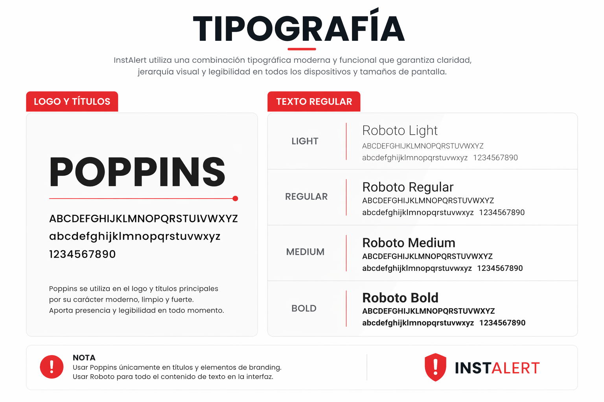
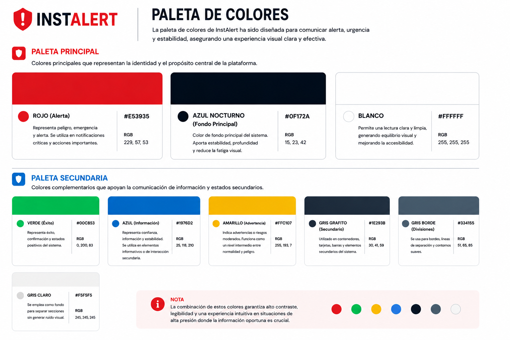
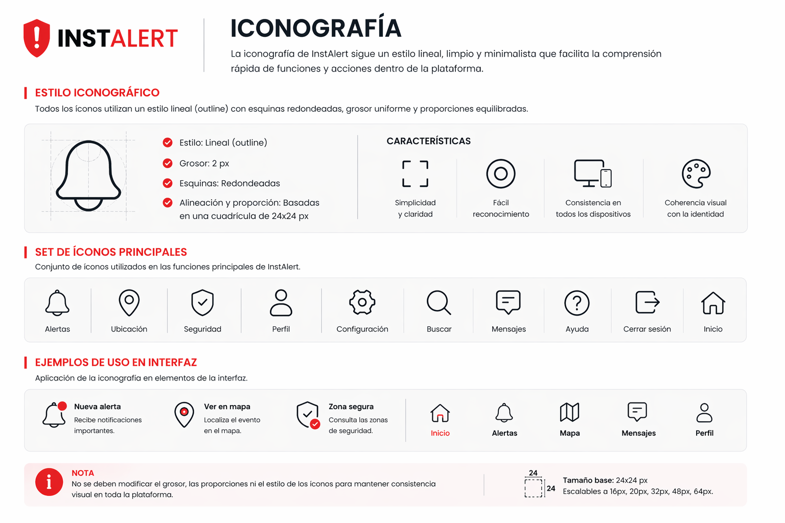

# Capítulo IV: Product Design
## 4.1 Style Guidelines

InstAlert es una plataforma web orientada a mejorar la seguridad ciudadana mediante el uso de tecnología y colaboración comunitaria. Su objetivo es permitir a los usuarios anticiparse a situaciones de riesgo a través de alertas en tiempo real, visualización de zonas peligrosas y comunicación inmediata entre ciudadanos. La plataforma busca ofrecer una experiencia rápida, clara y confiable, adaptada a contextos de alta presión donde la información oportuna es crucial.
En esta sección se presenta una guía estructurada que unifica todos los elementos visuales y de diseño utilizados en InstAlert. Se organizan recursos como tipografías, paletas de colores, espaciados y componentes visuales con el objetivo de mantener una identidad coherente alineada con el propósito de la plataforma: brindar seguridad, rapidez de respuesta y confianza al usuario. Esta consistencia permite una navegación intuitiva y eficiente, optimizando la experiencia en situaciones donde cada segundo cuenta.
Asimismo, esta guía funciona como un repositorio centralizado de recursos de diseño, incluyendo tipografías, paletas de colores, componentes visuales y lineamientos de interfaz. Esto permite que todo el equipo de desarrollo trabaje bajo un mismo estándar visual, asegurando consistencia en cada parte del producto. 

### 4.1.1 General Style Guidelines

El branding de InstAlert está diseñado para transmitir urgencia, seguridad y confiabilidad, elementos fundamentales en una plataforma orientada a la prevención de riesgos. A través de una estética moderna, clara y funcional, se busca facilitar la comprensión rápida de la información y permitir al usuario actuar de forma inmediata.
La identidad visual combina colores de alto contraste con elementos minimalistas, priorizando la legibilidad y la rapidez de interacción. El diseño evita elementos innecesarios o decorativos, enfocándose en una experiencia directa y efectiva. De esta manera, InstAlert logra comunicar su propósito principal: mantener a los usuarios informados y protegidos en todo momento.
En cuanto a las dimensiones del tono de comunicación, InstAlert se posiciona como:
Serio (debido a la naturaleza crítica de la seguridad)
Formal (para transmitir confianza y credibilidad)
Respetuoso (en el manejo de información sensible)
Directo y enfocado a la acción (priorizando claridad sobre expresividad)
Para la definición de estos lineamientos, se tomaron como referencia principios de diseño centrados en el usuario y sistemas de diseño modernos como Material Design (Google, 2014) , priorizando la claridad, la jerarquía visual y la accesibilidad en entornos digitales. 

4.1.1.1. Tipografía
La tipografía de InstAlert ha sido seleccionada para garantizar claridad, rapidez de lectura y accesibilidad, especialmente en situaciones donde el usuario necesita interpretar información de forma inmediata.

  

Tipografía del Logo y Títulos
Se utiliza la tipografía Poppins, la cual destaca por su diseño moderno, limpio y altamente legible. Su estructura geométrica transmite orden, tecnología y confianza, características esenciales para una plataforma de seguridad. Además, su versatilidad permite mantener una presencia visual fuerte sin comprometer la claridad.

  

Tipografía de Texto Regular
Para el contenido general de la aplicación se emplea la tipografía Roboto, elegida por su excelente legibilidad en pantallas digitales. Se utilizan diferentes pesos tipográficos (light, regular, medium y bold) para estructurar la información y facilitar la jerarquía visual, permitiendo al usuario identificar rápidamente elementos importantes como alertas, mensajes y acciones.

  

4.1.1.2. Colores
La paleta de colores de InstAlert ha sido diseñada para comunicar alerta, urgencia y estabilidad, asegurando una experiencia visual clara y efectiva.

  

Paleta Principal
Rojo (#E53935): Representa peligro, emergencia y alerta. Es el color principal de la plataforma, utilizado en notificaciones críticas y acciones importantes.
Gris Oscuro (#1E1E1E): Aporta seriedad, enfoque y contraste. Se utiliza como base para fondos y elementos estructurales.
Blanco (#FFFFFF): Permite una lectura clara y limpia, generando equilibrio visual y mejorando la accesibilidad.
Paleta Secundaria
Amarillo (#FFC107): Indica advertencias o riesgos moderados. Funciona como un nivel intermedio entre normalidad y peligro.
Azul (#1976D2): Representa confianza, información y estabilidad. Se utiliza en elementos informativos o de interacción secundaria.
Gris Claro (#F5F5F5): Se emplea como fondo para separar secciones sin generar ruido visual.

  

4.1.1.3. Espaciado
El espaciado en la interfaz de InstAlert sigue una estructura basada en múltiplos de 8 (8, 16, 24, 32 y 48 píxeles), lo que permite mantener consistencia y orden visual en toda la plataforma.
Este sistema facilita la organización de los elementos, mejora la legibilidad y evita la saturación de información, algo fundamental en una aplicación donde el usuario debe identificar rápidamente datos relevantes. Además, permite una adaptación fluida a diferentes dispositivos, garantizando una experiencia consistente tanto en escritorio como en dispositivos móviles.

4.1.1.4. Iconografía
La iconografía en InstAlert se basa en un estilo minimalista y lineal, utilizando íconos simples y universalmente reconocibles que facilitan la comprensión inmediata.
Se prioriza el uso de símbolos claros como:
🚨 Alertas
📍 Ubicación
🔔 Notificaciones
👤 Perfil
Estos elementos permiten reducir la carga cognitiva del usuario, facilitando la navegación incluso en situaciones de estrés o urgencia. Además, los íconos mantienen coherencia visual con el diseño general, reforzando la identidad de la plataforma.

  

4.1.1.5. Tono de Comunicación y Lenguaje Aplicado
El tono de InstAlert es directo, claro y orientado a la acción. La plataforma está diseñada para transmitir información de manera rápida y efectiva, evitando ambigüedades o lenguaje innecesario.
Se utiliza un lenguaje sencillo y comprensible, priorizando frases cortas y mensajes concretos como:
“Alerta cercana detectada”
“Reportar incidente”
“Zona de riesgo”
Este enfoque permite que el usuario entienda inmediatamente la situación y pueda actuar sin confusión. Al mismo tiempo, el tono mantiene un nivel de formalidad que transmite confianza y seguridad, reforzando el propósito de la plataforma.

### 4.1.2 Web Style Guidelines

En el diseño visual de InstAlert se adopta una línea gráfica moderna, minimalista y funcional, enfocada en la eficiencia y la claridad de la información.
La jerarquía visual se construye mediante el uso de tipografías bien definidas, tamaños diferenciados y colores de alto contraste que permiten identificar rápidamente los elementos más importantes. Los botones interactivos presentan estados visuales claros (normal, hover y activo), brindando retroalimentación inmediata al usuario.
El uso de bordes suaves y sombras sutiles contribuye a una interfaz limpia y organizada, evitando distracciones innecesarias. Asimismo, los componentes visuales están diseñados para mantener consistencia en toda la plataforma, facilitando la navegación y reduciendo la curva de aprendizaje del usuario.
Finalmente, cada elemento del diseño ha sido pensado para cumplir un propósito funcional dentro de la experiencia, asegurando que la interfaz no solo sea atractiva, sino también eficiente en contextos donde la rapidez y la precisión son esenciales.
Además, el diseño considera principios de diseño responsive, asegurando que la interfaz mantenga su funcionalidad y claridad en distintos dispositivos y tamaños de pantalla. 

## 4.2. Information Architecture.
### 4.2.1. Organization Systems.
Para nuestra aplicación se opta por una organización visual jerárquica con elementos secuenciales. Esto permite que el usuario identifique fácilmente los puntos clave, organizando el contenido en categorías como “Alertas”, “Reportes” o “Comunidad”, y en subcategorías dentro de cada una. Así, la información se presenta de forma clara y sin sobrecargar.  
Además, en ciertas secciones se incorporan flujos secuenciales que guían al usuario paso a paso para completar tareas o llegar a páginas específicas. Esta estructura facilita aplicar principios de arquitectura de información como claridad, accesibilidad, navegación enfocada y facilidad de uso. Finalmente, gracias a la investigación previa, se asegura que el contenido de cada categoría sea relevante y útil para el usuario. 

  
Nota: Diagrama de organización de información de las aplicaciones  

  
Nota: Diagrama de organización de información del landing page  

link: https://miro.com/welcomeonboard/b0FzeXNSWmswV1NMaURXSzdnOVR1SXZSWCt5T0JKQUZ5Ykx2d3FOaVRIUmpvaXc4Tk5lTWw1R2xEK0ZaMjZEWXlueDBvQUJ1ODFYNWYrS2kwYWdJYUJkQUJ5cEdTSzROakxtRzVMTGhFdUlXODZ5LzBvV2hXVjk3MUZLOTFGTHpyVmtkMG5hNDA3dVlncnBvRVB2ZXBnPT0hdjE=?share_link_id=9527554603  

### 4.2.2. Labeling Systems.
Para este trabajo se optó por una taxonomía jerárquica que estructura la app y el sitio web mediante nodos principales y ramificaciones lógicas, agrupando los elementos según su similitud (por ejemplo, secciones informativas como “Visión” y “Misión”, y funciones interactivas como “Mapa” y “Reportes”). Este enfoque mejora la navegación intuitiva y disminuye la confusión del usuario, en línea con los principios de arquitectura de la información que priorizan la claridad y la escalabilidad del contenido.
Esta decisión responde a la necesidad de gestionar el contenido como “objetos” dinámicos con atributos y ciclos de vida, lo que permite ofrecer alternativas relevantes para distintos tipos de usuarios, desde quienes solo buscan información hasta aquellos que interactúan activamente reportando incidentes. 

  
Nota. Labeling de las aplicaciones.  
  
Nota. Labeling del landing page. 

### 4.2.3. SEO Tags and Meta Tags

Para asegurar la correcta indexación y visibilidad de InstAlert en los motores de búsqueda, se ha definido una estrategia de SEO que diferencia el tratamiento de la Landing Page, orientada a la conversión de usuarios (vecinos y comerciantes), frente a la Web Application, enfocada en la usabilidad y gestión. En ambos casos, se integrarán etiquetas fundamentales: el Title se configurará para reflejar la propuesta de valor única de cada sección, mientras que la Meta Description sintetizará la capacidad de respuesta y prevención de la plataforma para atraer clics relevantes. Se utilizarán Keywords estratégicas como "seguridad ciudadana", "botón de pánico", "mapas de calor" y "alertas en tiempo real" para captar la intención de búsqueda del segmento objetivo, y se definirá el tag Author como "InstAlert Development Team" para establecer la autoría oficial. Esta configuración no solo optimiza el posicionamiento orgánico, sino que también garantiza una presentación coherente y profesional del ecosistema de seguridad en los resultados de búsqueda.

### 4.2.4. Searching Systems.

Se optó por integrar esta característica en el funcionamiento del mapa de calor, para ello se utilizaron los filtros de Tipo de incidente, Fecha, Intensidad, Ubicación, Frecuencia.
Filtros y descripciones para incidentes:

|FILTROS	   	|	DESCRIPCIÓN|
|----|----|
|Tipo de incidente	|		Muestra que clase de reportes o eventos se desean visualizar en el mapa, como robos, accidentes, emergencias médicas, incendios u otros. |
|Fecha        |                     Muestra información según un período específico, ya sea por día, semana, mes o un rango de tiempo definido por el usuario.
|Intensidad| Muestra el nivel de riesgo o gravedad de los incidentes en la zona, diferenciándolos por categorías como bajo, medio o alto.|
|Frecuencia|Permite visualizar únicamente aquellas áreas que superan un número máximo de reportes, destacando las zonas más activas.|

Nota. La tabla muestra los filtros que se pueden aplicar para los incidentes.  

Para el sistema de búsqueda de la sección Comunidad, se definieron filtros que permiten a los usuarios navegar de manera clara y organizada entre foros y publicaciones. Estos filtros facilitan la localización de contenidos relevantes, reducen la sobrecarga de información y aseguran que cada usuario pueda encontrar con rapidez lo que más le interesa.

|FILTROS		|			DESCRIPCIÓN|
|---|---|
|Tipo de incidente|
Filtra las publicaciones y foros según su temática (seguridad, eventos locales, prevención, avisos oficiales, etc.).|
|Fecha|Permite ordenar las publicaciones por día, semana, mes o rango personalizado, mostrando primero los contenidos más recientes o históricos.|
|Popularidad|Destaca los foros y publicaciones con mayor número de interacciones (me gusta, comentarios, compartidos).|
|Entidades / Usuarios|Permite seleccionar publicaciones hechas por entidades oficiales, organizaciones comunitarias o usuarios particulares.|
|Ubicación|Filtra las publicaciones según la zona geográfica del usuario, mostrando primero las más cercanas a su área de interés.|

Nota. La tabla muestra los filtros que se pueden aplicar para la pestaña de comunidad InstAlert

### 4.2.5. Navigation Systems.

La arquitectura de navegación se estructura en diferentes apartados que permiten al usuario identificar y acceder de forma clara a la información más relevante de la aplicación. Cada sección cumple una función específica dentro del sistema de navegación.
|NOMBRE		|			DESCRIPCIÓN|
|-|-|
|Inicio|Es la primera cara de la página web, donde se presenta la aplicación y sus funcionalidades básicas.|
|Producto|Se mostrará información detallada del producto en sus diferentes versiones, incluyendo características, beneficios y distintas opciones de descarga.|
|Noticias|Se presenta información sobre actualizaciones, lanzamientos, mejoras del producto y anuncios relevantes para los usuarios. InstAlert|
|Sobre nosotros|Ofrece una descripción de la misión, visión, valores y trayectoria de la empresa o equipo desarrollador, resaltando su compromiso con los usuarios.|

Nota. La tabla muestra los apartados que se pueden encontrar para la arquitectura de navegación
Para el sistema de navegación de la aplicación, se optó por organizar la información en distintas secciones, con el objetivo de ofrecer una presentación visual más ordenada y facilitar la orientación del usuario. Asimismo, se reducirá el uso de elementos textuales y se acordó que los componentes interactivos estén acompañados de un título breve que describa claramente su función.
|NOMBRE				|	DESCRIPCIÓN|
|-|-|
|Dashboard|Muestra la información principal sobre la situación actual, incluye acceso directo al botón de pánico y presenta el estado actual del celular.|
|Mapa|Presenta un mapa de calor que resalta las zonas según su nivel de riesgo y muestra la ubicación de los reportes y alertas más recientes.|
|Reportes|Exhibe los reportes más recientes clasificados por hora y fecha, con un énfasis en los reportes generados por el propio usuario.|
|Comunidad|Contiene publicaciones de entidades y organizaciones, ordenadas cronológicamente según el tiempo de emisión.|
|Dispositivos|Indica el estado de los dispositivos que utilizan la aplicación y muestra información básica de los dispositivos de contactos que otorgaron permiso de visualización.|
|Configuración|Presenta una serie de opciones agrupadas en distintos segmentos para personalizar la aplicación y su servicio|
Nota. La tabla muestra los apartados del sistema de navegación dentro del app

## 4.3 Landing Page UI Design

### 4.3.1 Landing Page Wireframe

### 4.3.2 Landing Page Mock-up

## 4.4 Web Applications UX/UI Design

### 4.4.1 Web Applications Wireframes

### 4.4.2 Web Applications Wireflow Diagrams

### 4.4.3 Web Applications Mock-ups

### 4.4.4 Web Applications User Flow Diagrams

## 4.5 Web Applications Prototyping

## 4.6 Domain-Driven Software Architecture

### 4.6.1 Design-Level Event Storming

### 4.6.2 Software Architecture Context Diagram

### 4.6.3 Software Architecture Container Diagrams

### 4.6.4 Software Architecture Components Diagrams

## 4.7 Software Object-Oriented Design
