# Capítulo V: Product Implementation, Validation & Deployment
## 5.1. Software Configuration Management
La Gestión de Configuración de Software (SCM, por sus siglas en inglés) es una disciplina en el desarrollo de software encargada de identificar, controlar y rastrear los componentes del software a lo largo de su ciclo de vida. Esta metodología facilita la administración organizada de cambios en documentos, códigos y otros elementos durante el proceso de desarrollo, garantizando así una gestión eficiente y ordenada. Su objetivo principal es mejorar la eficiencia del equipo de desarrollo y minimizar los errores. (Martin, 2023)

### 5.1.1. Software Development Environment Configuration.

**Definición de Requisitos**

Antes de iniciar el desarrollo, es crucial definir claramente los requisitos de KSI. Estos requisitos incluyen las funcionalidades clave que deseamos proporcionar, tales como:

- Automatización de Tareas: Implementación de herramientas que optimicen y automaticen tareas repetitivas para mejorar la eficiencia.
- Gestión de Información Robusta: Uso de bases de datos para una administración efectiva de la información del proyecto.
- Características Personalizables: Opciones adaptables a las necesidades específicas de cada startup.
- Colaboración Eficiente: Funcionalidades que faciliten la colaboración efectiva entre equipos, incluyendo soporte para metodologías ágiles.

**Elección de la Tecnología**
Con base en los requisitos, hemos seleccionado las siguientes tecnologías para KSI:

- Frontend: Angular para una interfaz de usuario dinámica y receptiva, que permita una interacción fluida con las herramientas de gestión y análisis.

- Configuración del Entorno de Desarrollo ItelliJ IDEA
    - Editor de Código: IntelliJ IDEA.
    - Propósito: Desarrollo de software y edición de código.
    - Ruta de descarga: https://www.jetbrains.com/idea/download/

- Editor de Código: Visual Studio Code
    - Propósito: Desarrollo y edición de código con soporte extensivo para JavaScript y herramientas de desarrollo.
    - Ruta de descarga: https://code.visualstudio.com/

- Control de Versiones: Git, con repositorios en GitHub.
    - Propósito: Gestión de versiones y colaboración en el código.
    - Ruta de descarga: https://git-scm.com/
    - Repositorio: https://github.com/instalert-startup/instalert-project-report 

**Product UX/UI Design**
- UI/UX: Crear una interfaz amigable y accesible para los usuarios.
    - Herramienta: Figma
    - Propósito: Diseño de prototipos y interfaces de usuario.

**Software Development HTML:**

- Descripción: El lenguaje base de etiquetado para aplicaciones web sera empleado en este proyecto.
- Enlace: https://www.w3schools.com/html/default.asp 

**CSS:**

Con KSI, buscamos no solo ofrecer herramientas de gestión de proyectos eficientes, sino también actuar como un socio estratégico para las startups, facilitando su crecimiento y éxito en el competitivo mercado tecnológico.

### 5.1.2. Source Code Management.
**Gestión de Cambios en el Código Fuente con GitHub**
En esta sección, nuestro equipo detalla los métodos y la estructura organizativa para gestionar los cambios en el código fuente utilizando GitHub como plataforma de control de versiones. Hemos configurado un repositorio remoto en GitHub para almacenar el código fuente y facilitar la colaboración entre los miembros del equipo. Los URLs de los repositorios son los siguientes:
- Landing Page: https://instalert-startup.github.io/landing-page/

**Estructura del Repositorio**

Hemos organizado el repositorio en ramas específicas para diferentes etapas del desarrollo, garantizando un flujo de trabajo ordenado y eficiente. La estructura de ramas es la siguiente:

- Main branch (rama principal): Contiene la versión estable y lista para producción del software.
- Develop branch: Contiene el código en desarrollo que se integrará en la rama principal después de ser probado y validado.

**Documentación**
La documentación del proyecto se encuentra en el archivo README.md dentro del repositorio. Este archivo proporciona detalles sobre la configuración, el uso del software y las guías para contribuir al proyecto.

### 5.1.3. Source Code Style Guide & Conventions.
En el Source Code Style Guide, presentaremos las convenciones, estilos, diseños y principios aplicados en los lenguajes utilizados durante el desarrollo de nuestro producto. Los lenguajes y herramientas empleados incluyen:

**LENGUAJES UTILIZADOS**

- *HTML* : Estructura del contenido en la web, utilizando etiquetas semánticas para mejorar la accesibilidad.
- *CSS*: Estilos y diseño visual del software, garantizando una experiencia de usuario óptima.

**HTML**

- Nombres Descriptivos: Utiliza nombres de clases e IDs que sean descriptivos y significativos, facilitando la comprensión del propósito de cada elemento. Por ejemplo, en lugar de box, usa project-card.
- Indentación: Indenta correctamente el código HTML para mejorar la legibilidad y mantener una estructura clara.
- Etiquetas Semánticas: Emplea etiquetas semánticas apropiadas, como `<header>`, `<nav>`, `<main>`, y `<footer>`, para mejorar la accesibilidad y el SEO del sitio.
- Comentarios: Usa comentarios para explicar secciones complejas o partes importantes del código HTML, facilitando la comprensión para otros desarrolladores.

**CSS**

- Nombres Descriptivos: Utiliza nombres de clases y selectores que sean descriptivos y coherentes para facilitar la identificación y el mantenimiento de los estilos. Por ejemplo, usa btn-submit en lugar de btn.
- Agrupación y Comentarios: Agrupa propiedades relacionadas y separa secciones de CSS con comentarios claros, como `/* Estilos de botones */`. Esto organiza el código y facilita su navegación.
- Preferencia por Clases: Prefiere el uso de clases en lugar de IDs para estilos reutilizables y más flexibles.
- Compatibilidad y Prefijos: Utiliza prefijos de vendedor y asegúrate de que el código sea compatible con diferentes navegadores cuando sea necesario.
- Medidas Relativas: Usa medidas relativas como em, rem, y % en lugar de medidas absolutas para mejorar la flexibilidad y la accesibilidad del diseño.

### 5.1.4. Software Deployment Configuration.

En los siguientes pasos se explicará cómo llevar a cabo la implementación de nuestro sitio web utilizando GitHub Pages

Deploy con GitHub Pages: En primer lugar, accedemos al repositorio de GitHub donde se encuentra nuestro proyecto y luego navegamos hacia la configuración del repositorio.

Dentro del menú de ajustes, elegimos la opción "Pages".

**Control de Versiones**

- Uso de Git: Mantén un historial completo de cambios y facilita el manejo de diferentes versiones del código.

En la sección de GitHub Pages, escogemos la rama principal (main) en el menú desplegable de la sección "Branch" y guardamos la configuración presionando el botón "Save". Después de unos momentos, recibiremos el enlace a nuestro sitio web publicado en GitHub Pages.

## 5.2. Landing Page, Services & Applications Implementation

### 5.2.1. Sprint 1

En este primer sprint se desarrolló la landing page y la documentación inicial del proyecto InstAlert.

#### 5.2.1.1. Sprint Planning 1

| Sprint # | Sprint 1 |
| :--- | :--- |
| **Sprint Planning Background** | |
| Date | 11/04/2026 |
| Time | 3:30 PM |
| Location | Google Meet |
| Prepared By | Alexander Paolo Justo Yauricasa |
| Attendees (to planning meeting) | Piero Leonardo Molina Falcón Sebastian Victor Andre Diaz Mendoza Breithner Rodolfo Perez Encarnación Alexander Paolo Justo Yauricasa |
| **Sprint 1 Review Summary** | Durante este sprint, el equipo se enfocó en sentar las bases estratégicas del proyecto InstAlert. Se completaron entregables clave de UX como User Personas, Journey Maps y la arquitectura de información, que guiaron el diseño de la plataforma. Con esta base, se diseñó, maquetó y desplegó la primera versión funcional de la landing page. Esta página incluye la propuesta de valor del SaaS, los planes de suscripción. |
| **Sprint 1 Retrospective Summary** | Los miembros del equipo coincidieron en que la colaboración fue fluida gracias a la correcta asignación de roles. Se destacó la sinergia entre el diseño en Figma y la configuración inicial de los repositorios. Para el siguiente sprint, se identificó la oportunidad de mejorar la estimación de tiempos de desarrollo al iniciar la integración del backend. |
| **Sprint Goal & User Stories** | |
| **Sprint 1 Goal** | Nos enfocamos en entregar una primera versión de la landing page desplegada y la documentación de los primeros capítulos del informe. Creemos que esto entrega una propuesta de valor validada para atraer a nuestro segmento objetivo. Esto se confirmará cuando la web esté pública y el informe sea aprobado. |
| **Sprint 1 Velocity** | 20 |
| **Sum of Story Points** | 20 |

#### 5.2.1.2. Aspect Leaders and Collaborators

| Team Member | GitHub Username | Landing Page | Diseño UI/UX | Documentación |
| :--- | :--- | :--- | :--- | :--- |
| Piero Leonardo Molina Falcón | PieroMFAL | Colaborador | Colaborador | Líder |
| Alexander Paolo Justo Yauricasa | AlexanderJusto | Líder | Colaborador | Colaborador |
| Sebastian Victor Andre Diaz Mendoza | DiazDeveloper | Colaborador | Colaborador | Colaborador |
| Breithner Rodolfo Perez Encarnación | Breithner1 | Colaborador | Líder | Colaborador |

#### 5.2.1.3. Sprint Backlog 1

| User Story Id | User Story Title | Work Item/Task Id | Work Item/Task Title | Description | Estimation | Assigned To | Status |
| :--- | :--- | :--- | :--- | :--- | :--- | :--- | :--- |
| US-13 | Descarga de la aplicación | T01 | Maquetado HTML base | Estructura de la landing: header, hero section y footer. | 3h | Alexander Justo | Done |
| US-14 | Visualización de información de la plataforma | T02 | Informacion landing | Implementación de la informacion de la aplicacion. | 2h | Piero Molina | Done |
| US-15 | Registro desde la landing page | T03 | Contacto | Implementacion de un formulario para contactarnos. | 2h | Sebastian Diaz | Done |
| US-16 | Visualización de testimonios o casos de uso | T04 | Testimonios | Revicion de las entrevistas y inplementacion de estas. | 2h | Breithner Perez | Done |

#### 5.2.1.4. Development Evidence for Sprint Review

En este primer Sprint hemos realizado la implementación de nuestra Landing Page y la configuración inicial de los repositorios, donde todo el equipo ha aportado mediante la gestión de ramas. En la siguiente tabla se muestran los commits realizados.

| Repository | Branch | Commit Id | Commit Message | Commit Message Body | Commited on (Date) |
| :--- | :--- | :--- | :--- | :--- | :--- |
| instalert-startup/landing-page | main | 15ad028 | Initial commit | Initial commit | 19/04/2026 |
| instalert-startup/landing-page | main | 33ad2a9 | Actualización de index.html | Agregar codigo de html. | 19/04/2026 |
| instalert-startup/landing-page | main | 51ad5a7 | Actualización de index.html | Correcciones. | 03/05/2026 |

#### 5.2.1.5. Execution Evidence for Sprint Review.
En este Sprint, los miembros del equipo de desarrollo de software de KSI han completado y desplegado la Landing Page. A continuación, mostramos imágenes que demuestran cómo nuestra página presenta de manera clara e intuitiva la información sobre nuestro producto y nuestra empresa.

  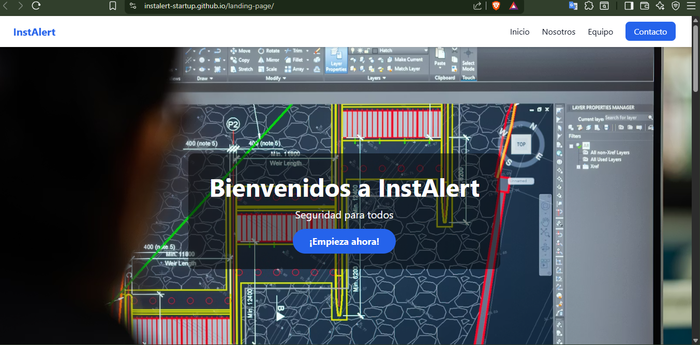

#### 5.2.1.6. Services Documentation Evidence for Sprint Review.
No se emplearon servicios adicionales, ya que este primer sprint se centró exclusivamente en la implementación de la primera versión del web application.

#### 5.2.1.7. Software Deployment Evidence for Sprint Review.

**Resumen**
Durante este Sprint, nos hemos enfocado en el despliegue de la landing page. Las actividades realizadas incluyen la configuración del entorno de desarrollo y el despliegue inicial del sitio. A continuación, se detalla el proceso seguido para el despliegue de la landing page.

**Actividades Realizadas**

- Creación de Cuentas y Configuración de Recursos:
Proveedor de Hosting: Selección y configuración de la cuenta en el proveedor de hosting para desplegar la landing page. Configuración del Entorno: Establecimiento del entorno de desarrollo y producción para la landing page.

- Configuración de Proyectos para Integración:
Repositorio de Código: Configuración del repositorio en GitHub para la integración continua y despliegue automático. Automatización: Configuración de scripts y herramientas para la automatización del despliegue.

- Despliegue de la Landing Page:
Subida de Archivos: Transferencia de archivos y recursos al servidor de hosting. Verificación: Comprobación de que la landing page se despliega correctamente y está accesible en la web.

Enlace al Repositorio: https://github.com/instalert-startup/landing-page 

#### 5.2.1.8. Team Collaboration Insights during Sprint.
En esta sección, se presenta un análisis detallado de la colaboración del equipo durante el Sprint. Durante este sprint, las actividades de implementación se organizaron siguiendo una metodología ágil, garantizando una colaboración fluida entre los miembros del equipo. Se exponen capturas de los analíticos de colaboración y de los commits realizados en GitHub, lo que permite visualizar la contribución individual de cada miembro del equipo.

- Diseño y Desarrollo: Diseño de la Landing Page: Desarrollo y diseño completo de la landing page, incluyendo la creación de secciones y funcionalidad. Implementación: Realización de las tareas de codificación, pruebas y ajustes necesarios para completar la página.
- Documentación y Despliegue: Documentación: Creación de documentación relevante para la landing page, incluyendo capturas de pantalla y descripciones. Despliegue: Configuración del entorno de despliegue y transferencia de archivos al servidor.
URL LANDING PAGE DESPLEGADA: https://instalert-startup.github.io/landing-page/

### 5.2.2. Sprint 2

#### 5.2.2.1. Sprint Planning 2

| Sprint # | Sprint 2 |
| :--- | :--- |
| **Sprint Planning Background** | |
| Date | 10/05/2026 |
| Time | 5:30 PM |
| Location | Virtual |
| Prepared By | Sebastian Victor Andre Diaz Mendoza |
| Attendees (to planning meeting) | Piero Leonardo Molina Falcón Sebastian Victor Andre Diaz Mendoza Alexander Paolo Justo Yauricasa Breithner Rodolfo Perez Encarnación |
| **Sprint 2 Review Summary** | Durante este sprint, el equipo se enfocó de lleno en el desarrollo e implementación de la interfaz de usuario (UI) de la aplicación web InstAlert. Se logró maquetar, diseñar e integrar la experiencia visual abarcando un total de 23 Historias de Usuario (HU). Esto incluyó la creación de componentes interactivos, vistas de reportes, mapas de zonas de riesgo y flujos de navegación, sentando toda la base frontend de la plataforma. |
| **Sprint 2 Retrospective Summary** | El equipo demostró una gran capacidad de ejecución y coordinación para manejar el alto volumen de tareas visuales. El uso de componentes reutilizables agilizó significativamente el desarrollo de las 28 HU. Como punto de mejora, identificamos que para los próximos sprints debemos optimizar los tiempos de revisión en los Pull Requests para evitar cuellos de botella antes de integrar la lógica de negocio y la conexión con bases de datos. |
| **Sprint Goal & User Stories** | |
| **Sprint 2 Goal** | Completar el diseño y la maquetación frontend de la aplicación web InstAlert, garantizando que las interfaces de las 28 HU planificadas sean totalmente funcionales a nivel visual, responsivas y alineadas con la guía de estilos, dejando el proyecto listo para la integración con los servicios del backend. |
| **Sprint 2 Velocity** | 84 |
| **Sum of Story Points** | 84 |

#### 5.2.2.2. Aspect Leaders and Collaborators

Durante el desarrollo del Sprint 2, se han identificado distintos aspectos funcionales relacionados al diseño y construcción de la aplicación web de InstAlert. Con el objetivo de organizar el trabajo del equipo de manera eficiente, se ha elaborado una matriz de Liderazgo y Colaboración (LACX), donde se asigna a cada integrante el rol de líder (L) en los módulos clave del desarrollo que se le han asignado, y el rol de colaborador (C) en otros aspectos. 

Los aspectos definidos para este Sprint, basados en las 28 Historias de Usuario trabajadas, son:

1. **Apartado de Login:** Registro e inicio de sesión.
2. **Apartado de Configuración:** Perfil, preferencias de notificación y comunidades cercanas.
3. **Apartado de Comunidad:** Solicitudes de apoyo, asistentes rápidos y panel de monitoreo.
4. **Botón de Emergencia y Dashboard:** Envío, recepción, historial y cancelación de alertas con geolocalización.
5. **Reportes:** Creación, adjunto de evidencias y filtros de incidentes y zonas.
6. **Mapa de Riesgo:** Visualización, filtros por nivel de riesgo y búsqueda de direcciones.
7. **Revisión general y mejoras:** Pruebas visuales, responsividad y ajustes de UI/UX conjuntos.

A continuación, se presenta la matriz de responsabilidades del equipo:

| Team Member (Last Name, First Name) | GitHub Username | Login | Configuration | Community | Emergency Button & Dashboard | Reports | Risk Map | Review and improvements |
| :--- | :--- | :--- | :--- | :--- | :--- | :--- | :--- | :--- |
| Justo Yauricasa, Alexander Paolo | AlexanderJusto | L | L | L | C | C | C | C |
| Diaz Mendoza, Sebastian Victor Andre | DiazDeveloper | C | C | C | L | C | C | C |
| Perez Encarnación, Breithner Rodolfo | Breithner1 | C | C | C | C | L | C | C |
| Molina Falcón, Piero Leonardo | PieroMFAL | C | C | C | C | C | L | C |

#### 5.2.2.3. Sprint Backlog 2

| User Story Id | User Story Title | Work Item/Task Id | Work Item/Task Title | Description | Estimation | Assigned To | Status |
| :--- | :--- | :--- | :--- | :--- | :--- | :--- | :--- |
| US-01 | Registro de usuario | T01 | Interfaz de Registro | Maquetación del formulario para crear una nueva cuenta. | 3h | Alexander Justo | To Do |
| US-02 | Inicio de sesión | T02 | Interfaz de Login | Maquetación de la vista de autenticación de usuarios. | 2h | Alexander Justo | To Do |
| US-03 | Configuración de perfil | T03 | Vista Perfil y Comunidades | Diseño de los campos de usuario y apartado de comunidades cercanas. | 4h | Alexander Justo | To Do |
| US-23 | Configurar preferencias de notificación | T04 | UI Preferencias Notificación | Diseño de toggles y opciones para configuración de alertas. | 2h | Alexander Justo | To Do |
| US-26 | Solicitar apoyo a la comunidad cercana | T05 | Modal de Apoyo | Interfaz para emitir solicitudes de ayuda a vecinos. | 3h | Alexander Justo | To Do |
| US-27 | Solicitar un asistente rápido | T06 | Vista de Asistente Rápido | Maquetación del panel de solicitud de asistencia. | 2h | Alexander Justo | To Do |
| US-28 | Panel de monitoreo para contactos | T07 | UI Monitoreo Contactos | Diseño de lista y estado activo de contactos asignados. | 3h | Alexander Justo | To Do |
| US-04 | Envío de alerta de emergencia | T08 | UI Botón de Emergencia | Diseño del botón principal y pantalla de confirmación. | 4h | Sebastian Diaz | To Do |
| US-05 | Geolocalización automática en alertas | T09 | UI Indicador de Ubicación | Componente visual que muestra las coordenadas capturadas. | 2h | Sebastian Diaz | To Do |
| US-06 | Recepción de alertas cercanas | T10 | UI Alertas Entrantes | Tarjetas visuales para notificar emergencias en la zona. | 3h | Sebastian Diaz | To Do |
| US-07 | Cancelación de alerta | T11 | Modal de Cancelación | Interfaz con confirmación de seguridad para anular alerta. | 2h | Sebastian Diaz | To Do |
| US-08 | Historial de alertas | T12 | UI Lista de Historial | Tabla o timeline con el registro de alertas previas. | 3h | Sebastian Diaz | To Do |
| US-09 | Creación de reportes de incidentes | T13 | Formulario de Reporte | Maquetación del modal/página para detallar un incidente. | 3h | Breithner Perez | To Do |
| US-10 | Adjuntar evidencia a reportes | T14 | UI Subida de Archivos | Diseño de zona drag & drop y vista previa de imágenes. | 2h | Breithner Perez | To Do |
| US-11 | Visualización de reportes en el mapa | T15 | UI Pines en Mapa | Diseño de marcadores visuales para incidentes en el mapa. | 3h | Breithner Perez | To Do |
| US-12 | Filtro de reportes | T16 | UI Controles de Filtro | Selectores para filtrar incidentes por fecha y categoría. | 2h | Breithner Perez | To Do |
| US-22 | Reporte de zonas con poca iluminación | T17 | UI Reporte Iluminación | Variante del formulario adaptada a reportes de vía pública. | 2h | Breithner Perez | To Do |
| US-23 | Recibir alertas de emergencia cercanas | T18 | Popups de Emergencia | Diseño de la notificación emergente tipo banner. | 2h | Breithner Perez | To Do |
| US-25 | Recibir notificaciones de actividad comunitaria | T19 | Feed de Actividad | Diseño del listado lateral de notificaciones comunitarias. | 3h | Breithner Perez | To Do |
| US-26 | Enviar alerta a contactos de emergencia | T20 | UI Selector de Contactos | Interfaz para seleccionar a quién notificar en una alerta. | 2h | Breithner Perez | To Do |
| US-18 | Visualizar mapa de zonas de riesgo | T21 | UI Mapa Base | Contenedor principal para la visualización cartográfica. | 4h | Piero Molina | To Do |
| US-19 | Filtrar zonas por nivel de riesgo | T22 | UI Capas de Riesgo | Botones/Selectores de niveles (Alto, Medio, Bajo). | 3h | Piero Molina | To Do |
| US-20 | Consultar detalles de una zona de riesgo | T23 | Tarjeta de Detalles de Zona | Panel lateral flotante con estadísticas de la zona clicada. | 3h | Piero Molina | To Do |
| US-21 | Búsqueda de direcciones específicas | T24 | UI Barra de Búsqueda | Componente de input con diseño de autocompletado. | 2h | Piero Molina | To Do |

#### 5.2.2.4. Development Evidence for Sprint Review

En este segundo Sprint hemos realizado la implementación del fronte-end, donde todo el equipo ha aportado mediante la gestión de ramas. En la siguiente tabla se muestran los commits realizados.

| Repository | Branch | Commit Id | Commit Message | Commit Message Body | Commited on (Date) |
| :--- | :--- | :--- | :--- | :--- | :--- |
| DiazDeveloper | feature/Alexander | b133adb87ea2fe29bbab4b993cefd8f18ab7b842 | -- | -- | [12/05/2026] |
| DiazDeveloper | feature/report | 1ca6bd2ee4032be7b56aa7ceb6cd0f7e9e0f2840 | -- | -- | [12/05/2026] |
| DiazDeveloper | feature/sebdiaz | f7c920e4a1d83b56e0f4c2a918d7b3e52f6a0c84 | -- | -- | [12/05/2026] |
| DiazDeveloper | feature/piero | 3e8d1f70b25c94a6e0f3d1b728a59c4e16f80d23 | -- | -- | [12/05/2026] |

#### 5.2.2.5. Execution Evidence for Sprint Review.

Basado en el ejemplo que me proporcionaste y en la información de tu proyecto InstAlert, aquí tienes la redacción adaptada para tu reporte de sprint:

Durante este sprint, se desarrollaron 22 historias de usuario únicas centradas en la implementación de la aplicación web de InstAlert. Este sprint se enfocó en crear funcionalidades clave orientadas a la seguridad ciudadana, tales como el sistema de autenticación y configuración de cuentas, la implementación de un botón de emergencia con geolocalización automática, el módulo de reportes comunitarios y la visualización interactiva de mapas de riesgo. Las historias incluyen tanto el diseño de interfaces de usuario como la implementación de funciones críticas como el envío y recepción de alertas cercanas, la creación de reportes de incidentes con evidencia adjunta, y la capacidad de solicitar apoyo a la comunidad cercana.

El equipo completó con éxito todas las tareas planificadas para los apartados de Login, Configuración, Comunidad, Botón de emergencia, Reportes y Mapa de riesgo. Además, se logró un diseño responsive para todas las secciones clave de la aplicación, garantizando una experiencia de usuario fluida, intuitiva —fundamental para reducir la fricción en situaciones de alto estrés o urgencia— y completamente alineada con los objetivos estratégicos de prevención y reacción rápida de la plataforma.

Evidencia visual:

A continuación, se presentan capturas de pantalla de las vistas implementadas en este Sprint:

Inicio de sesión

  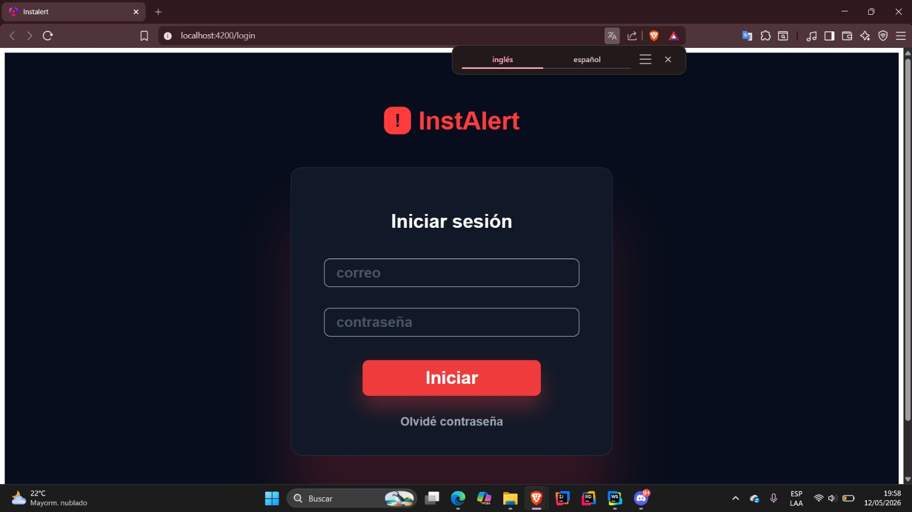

Configuración de perfil

  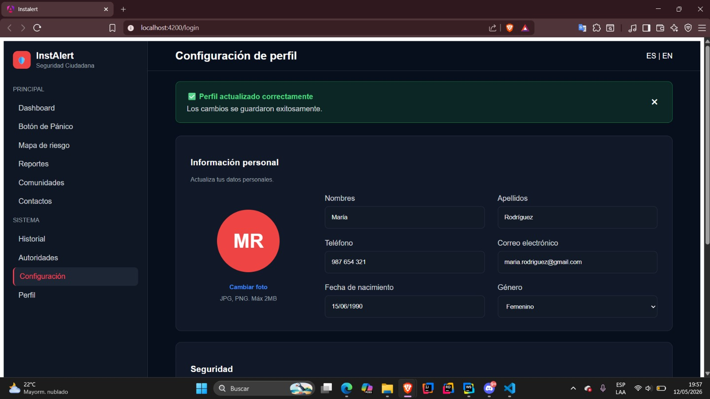

  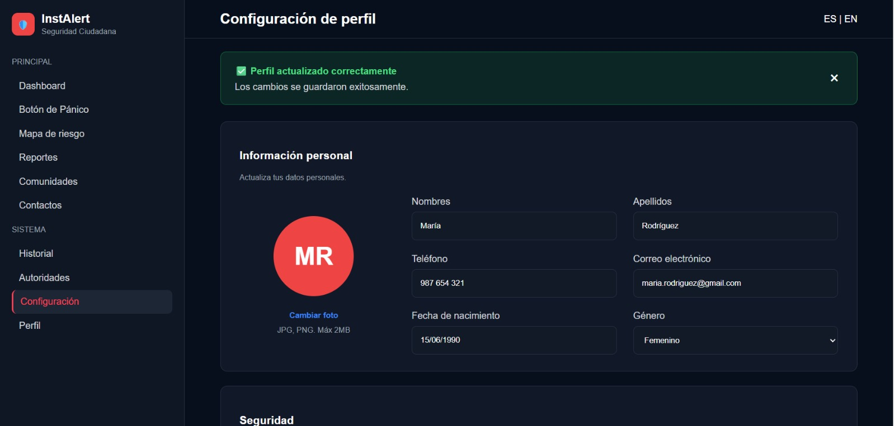

Botón de pánico

  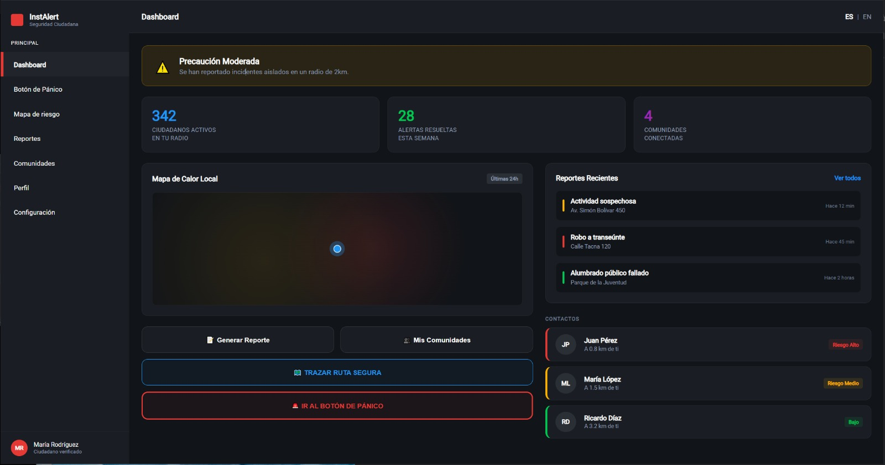

  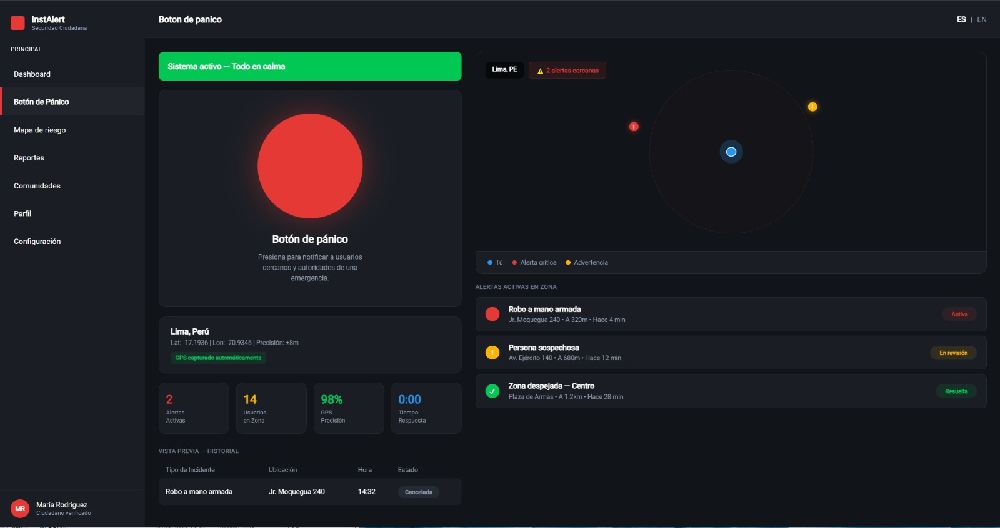

Reportes

  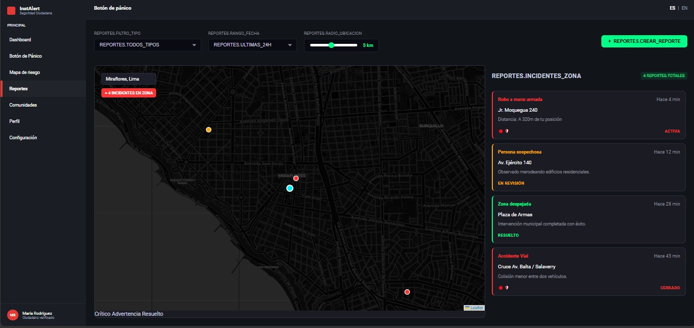

  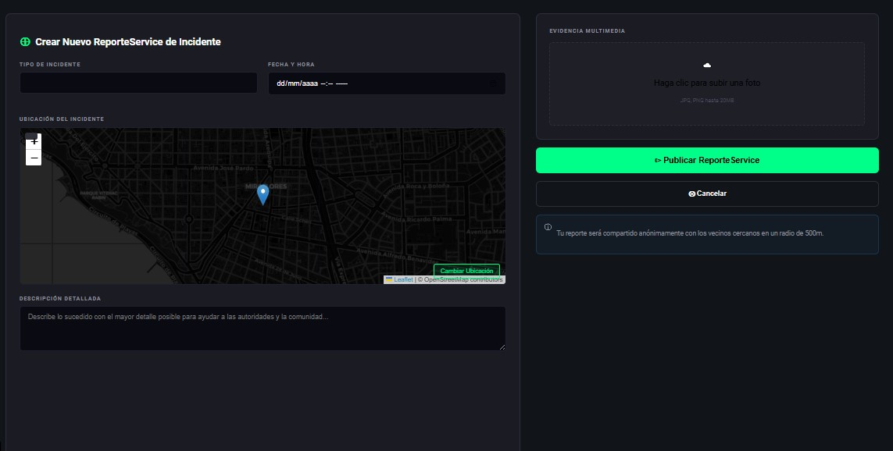

Mapa de Riesgo

  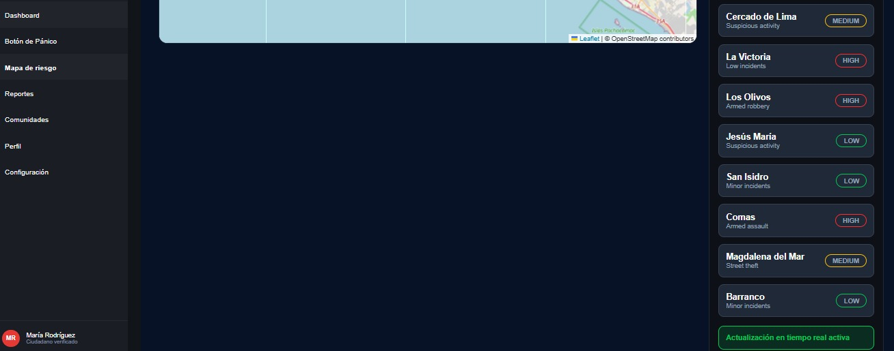

  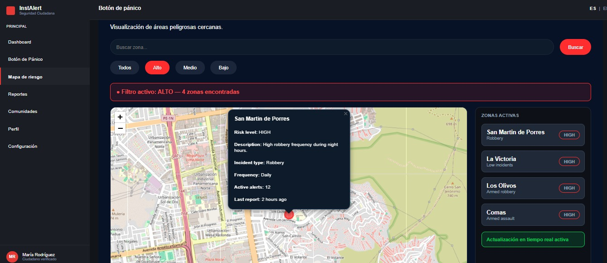

  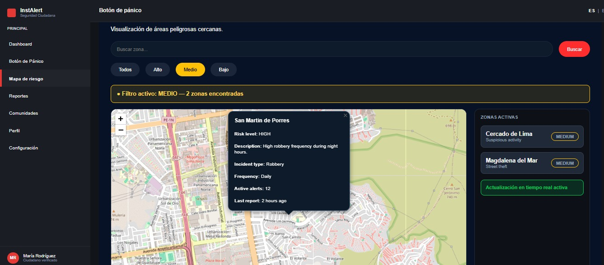

  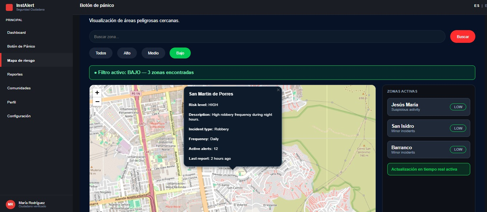

**Enlace de Repositorio:** [https://github.com/DiazDeveloper/instalert-app.git]

#### 5.2.2.6. Services Documentation Evidence for Sprint Review

Durante el Sprint 2, el desarrollo del frontend de InstAlert para las funcionalidades de autenticación, alertas de emergencia, reportes de incidentes, visualización del mapa de riesgos, gestión de comunidades y notificaciones se implementó utilizando una API fake. Esta API simulada se localiza en la carpeta `server` y dentro se encuentra el archivo `db.json`, el cual contiene toda la información de los datos utilizados. El uso de esta fake API (JSON Server) nos permitió emular las operaciones de una base de datos real y validar la interfaz gráfica sin depender del backend definitivo.

| Endpoint Simulado (Fake API) | Entidad Principal Gestionada | Operaciones CRUD Soportadas (Simuladas) vía JSON Server | Futuro Alcance con OpenAPI |
| :--- | :--- | :--- | :--- |
| `http://localhost:3000/users` | Usuarios (Users) | GET, POST, PUT | Documentación para el registro de usuarios, inicio de sesión, configuración de perfil y gestión de contactos de emergencia. |
| `http://localhost:3000/alerts` | Alertas (Alerts) | GET, POST, PUT, DELETE | Documentación para gestionar el envío, recepción, historial y cancelación de alertas de emergencia con geolocalización. |
| `http://localhost:3000/reports` | Reportes (Reports) | GET, POST | Documentación para la creación de reportes de incidentes, adjuntar evidencias y aplicar filtros de búsqueda. |
| `http://localhost:3000/risk-zones` | Zonas de Riesgo (Risk Zones) | GET | Documentación para consultar las coordenadas, detalles y niveles de riesgo de las zonas mostradas en el mapa interactivo. |
| `http://localhost:3000/communities` | Comunidades (Communities) | GET, POST | Documentación para obtener información de las comunidades cercanas y gestionar solicitudes de apoyo o asistentes rápidos. |
| `http://localhost:3000/notifications` | Notificaciones (Notifications) | GET, POST, DELETE | Documentación para gestionar las preferencias del usuario, recibir alertas entrantes y notificaciones de actividad comunitaria. |

#### 5.2.2.7. Software Deployment Evidence for Sprint Review.

**Resumen**
Durante este Sprint, el equipo se centró exclusivamente en el despliegue de la interfaz de usuario de nuestra aplicación web InstAlert. Para el alojamiento y la distribución del frontend en un entorno de producción accesible públicamente, utilizamos **Firebase Hosting**. 

Es importante destacar que, en cuanto a los servicios de backend, la arquitectura del proyecto contempla el uso de una API para gestionar y guardar la información registrada por los usuarios, así como el manejo de alertas y reportes. Sin embargo, en esta iteración, dicha lógica de integración y persistencia de datos aún no ha sido implementada, ya que el objetivo principal del sprint fue consolidar y validar la maquetación visual (UI) de las vistas.

**Enlace de Repositorio:** [https://github.com/DiazDeveloper/instalert-app.git]

#### 5.2.2.8. Team Collaboration Insights during Sprint.

En esta sección, se presenta un análisis detallado de la colaboración del equipo durante el Sprint. Las actividades de implementación se organizaron siguiendo una metodología ágil, garantizando una colaboración fluida. 

- **Diseño y Desarrollo:** [Resumen de cómo se dividieron y ejecutaron las tareas de código y diseño].
- **Documentación y Despliegue:** [Resumen de cómo se manejó la redacción del informe y las configuraciones de hosting/servidores].

### 5.2.3. Sprint 3

#### 5.2.3.1. Sprint Planning 3
En esta reunión de planificación se estableció el inicio del desarrollo del **backend real** para la plataforma InstAlert, migrando la lógica inicial y persistencia desde el entorno de simulación (Fake API) hacia una arquitectura orientada a microservicios y Bounded Contexts. El equipo Scrum determinó las actividades necesarias para implementar los controladores distribuidos, las validaciones de datos en tiempo real y la infraestructura de persistencia, integrando al nuevo miembro del equipo para acelerar la velocidad de desarrollo.

| Sprint # | Sprint 3 |
|---|---|
| **Sprint Planning Background** | |
| **Date** | 2026-06-02 |
| **Time** | 04:30 PM |
| **Location** | Google Meet |
| **Prepared By** | Sebastian Victor Andre Diaz Mendoza |
| **Attendees (to planning meeting)** | Sebastian Victor Andre Diaz Mendoza / Rodrigo Fabrizio Aguilar Untiveros / Alexander Paolo Justo Yauricasa / Piero Leonardo Molina Falcón / Breithner Rodolfo Perez Encarnación / Jhoan Darner Janampa Gutierrez |
| **Sprint n - 3 Review Summary** | Durante el Sprint 3, el equipo concentró sus esfuerzos en la construcción del **backend real** utilizando el marco de trabajo de **.NET** coordinado con una base de datos relacional **MySQL**. Se implementaron las APIs RESTful correspondientes a los Bounded Contexts core de la aplicación: Seguridad, Reportes, Alertas, Gestión de Comunidades y Dispositivos IoT. Se migraron los datos del antiguo entorno `db.json` hacia esquemas relacionales normalizados, optimizando las sentencias SQL y garantizando un puente de comunicación fluido con la UI desarrollada en el sprint anterior.  El equipo de ingeniería de software, liderado por **Sebastian Diaz**, gestionó la estructuración de la arquitectura limpia, logrando el desacoplamiento de capas lógicas y la encapsulación de las reglas de negocio. Por otro lado, Alexander Justo y el nuevo integrante, Jhoan Janampa, enfocaron sus actividades en el diseño de las validaciones transversales (`DataAnnotations`) y los mecanismos de respuesta rápida ante excepciones del sistema.  Breithner Perez** y Piero Molina trabajaron conjuntamente en el desarrollo y pruebas de los controladores dedicados al procesamiento de alertas críticas y geolocalización automatizada, reduciendo los tiempos de respuesta del lado del servidor. Adicionalmente, Rodrigo Aguilar lideró la integración de la documentación de endpoints mediante el estándar de OpenAPI y la interfaz interactiva de Swagger, facilitando la visibilidad del contrato de servicios para futuras fases de integración del sistema. |
| **Sprint n - 3 Retrospective Summary** | El equipo demostró una correcta curva de aprendizaje y adaptabilidad técnica al incorporar el ecosistema backend en sincronía con la base de datos de forma nativa. La adición de Jhoan Janampa robusteció la capacidad operativa, reduciendo el tiempo de maquetación de modelos de datos. Como puntos clave de éxito se identificaron: la estandarización de respuestas HTTP, la normalización de relaciones en la base de datos para prevenir redundancia de incidentes y el uso eficiente de Swagger como entorno centralizado de pruebas funcionales sin requerir herramientas externas. Como oportunidad de mejora para los próximos ciclos de trabajo, se detectó la necesidad de automatizar la ejecución de migraciones en la nube y establecer políticas de seguridad más estrictas para el acceso a la base de datos de producción. |
| **Sprint Goal & User Stories** | |
| **Sprint Goal** | Desarrollar, validar y desplegar la infraestructura inicial del backend para la aplicación web InstAlert, logrando la construcción de APIs RESTful eficientes bajo los Bounded Contexts definidos. El foco principal radica en garantizar la persistencia de datos reales para los flujos de autenticación de usuarios, emisión y geolocalización de alertas de emergencia, reportes comunitarios y control de dispositivos de seguridad, documentando los esquemas mediante OpenAPI. |
| **Sprint Velocity** | 95 |
| **Sum of Story Points** | 90 |

#### 5.2.3.2. Aspect Leaders and Collaborators

Durante el Sprint 3, se definieron los aspectos técnicos esenciales vinculados al backend y la infraestructura de datos de InstAlert. Con la finalidad de estructurar los flujos de trabajo de manera equitativa y mantener una trazabilidad organizada, se ha elaborado la matriz de **Liderazgo y Colaboración (LACX)**, detallando los roles asignados a los integrantes del equipo (incluyendo las actividades del nuevo miembro incorporado):

Los aspectos definidos para este Sprint son:
1. **Bounded Context de Account:** Registro, login y perfiles.
2. **Bounded Context de Emergency:** Botón de pánico.
4. **Bounded Context de Comunities:** Canales vecinales y mensajería en tiempo real.
5. **Bounded Context de Incidents:** Creación de incidentes, evidencias y mapa de calor.
6. **Diseño y Despliegue de Base de Datos Relacional:** Migración de esquemas hacia MySQL.

| Team Member (Last Name, First Name) | GitHub Username | B.C. Account | B.C. Emergency | B.C. Communities | B.C. Incidents | Despliegue DB |
|-------------------------------------|-----------------|--------------|----------------|------------------|----------------|--------------|
| Diaz Mendoza, Sebastian Victor Andre | DiazDeveloper   | L            | C              | C                | C              | L            |
| Justo Yauricasa, Alexander Paolo    | AlexanderJusto  | C            | L              | C                | C              | C            |
| Perez Encarnación, Breithner Rodolfo | Breithner1      | C            | C              | C                | L              | C            |
| Molina Falcón, Piero Leonardo       | PieroMFAL       | C            | C              | L                | C              | C            |
| Aguilar Untiveros, Rodrigo Fabrizio  | RodrigoAguilar  | C            | C              | C                | C              | C            |
| Janampa Gutierrez, Jhoan Darner     | JhoanJanampa    | C            | C              | C                | C              | L            |
#### 5.2.3.3. Sprint Backlog 3

El backlog de este sprint comprende las tareas y componentes de backend necesarios para dar soporte lógico y persistencia real a las interfaces responsive de InstAlert estructuradas en las iteraciones previas.

| User Story ID | Task Id | Title / Work-Item | Description | Estimation (Hours) | Assigned To | Status |
|---|---|---|---|---|---|---|
| **US-01 / US-02** | | **Autenticación Segura de Usuarios** | | | | |
| | 1 | Controladores de Registro e Inicio de Sesión | Desarrollar los endpoints POST en el controlador de usuarios para procesar accesos y creaciones de cuentas. | 5h | Sebastian Diaz | Done |
| | 2 | Validaciones de Modelo de Usuario | Implementar anotaciones de datos en los esquemas de entrada para asegurar contraseñas seguras y correos válidos. | 3h | Jhoan Janampa | Done |
| **US-04 / US-05** | | **Emisión de Alertas con Geolocalización** | | | | |
| | 1 | Endpoint de Activación de Emergencia | Construir el servicio encargado de capturar latitud, longitud y estatus de riesgo de forma simultánea ante un pulso del botón. | 6h | Alexander Justo | Done |
| | 2 | Servicio de Alertas Cercanas | Desarrollar la lógica de negocio encargada de segmentar y retornar los incidentes activos en un radio espacial determinado. | 5h | Piero Molina | Done |
| **US-09 / US-10** | | **Módulo de Reportes de Incidentes** | | | | |
| | 1 | Persistencia de Reportes Comunitarios | Crear el controlador y los repositorios asociados a la tabla de incidentes para almacenar categorías, fechas e intensidad del riesgo. | 5h | Breithner Perez | Done |
| | 2 | Adjunto Lógico de Evidencias | Implementar el almacenamiento de cadenas de texto y URLs asignadas a las evidencias gráficas adjuntadas por los vecinos. | 4h | Jhoan Janampa | Done |
| **US-18 / US-19** | | **Servicios de Mapas y Zonas de Riesgo** | | | | |
| | 1 | Endpoint de Coordenadas de Riesgo | Desarrollar los servicios GET necesarios para retornar las coordenadas y el nivel de criticidad que darán forma al mapa de calor interactivo. | 4h | Piero Molina | Done |
| **US-28** | | **Control de Dispositivos IoT** | | | | |
| | 1 | CRUD de Dispositivos Vinculados | Implementar controladores web dedicados al emparejamiento, desemparejamiento y lectura del estado de batería de los periféricos de pánico. | 6h | Rodrigo Aguilar | Done |

#### 5.2.3.4. Development Evidence for Sprint Review

En la presente tabla se listan los identificadores de confirmación (commits) y la distribución del desarrollo del backend del ecosistema InstAlert en los repositorios de control de versiones de GitHub:

| Repository | Branch | Commit Id | Commit Message | Commit Message Body | Commited on (Date) |
|---|---|---|---|---|---|
| instalert-startup/instalert-backend | main | e24bc81 | Initial backend commit | Setting up Clean Architecture folders | 02/06/2026 |
| instalert-startup/instalert-backend | feature/identity | a57d21c | feat: Add Identity and Access Bounded Context | Implemented user controllers and sign up validations | 04/06/2026 |
| instalert-startup/instalert-backend | feature/alerts | 3c89bf2 | feat: Add Emergency Control and Alertas endpoints | Geolocation models and real time triggers configured | 06/06/2026 |
| instalert-startup/instalert-backend | feature/reports | f451a99 | feat: Add Community Reporting module and entities | Connected reporting logic with risk analysis services | 08/06/2026 |
| instalert-startup/instalert-backend | feature/iot-devices | 9d22ef8 | feat: Add IoT Devices context and pairing functionality | Telemetry and peripheral controllers implemented | 09/06/2026 |
| instalert-startup/instalert-backend | develop | c82a411 | feat: InstAlert API Core Integration | Merged all bounded contexts and configured data layer | 10/06/2026 |

#### 5.2.3.5. Execution Evidence for Sprint Review

Durante el desarrollo del Sprint 3, la aplicación web de InstAlert abandonó los datos simulados locales para consolidar una arquitectura transaccional distribuida. Se configuraron los servicios bajo principios de Domain-Driven Design, logrando el aislamiento de responsabilidades y la consistencia en el procesamiento de eventos críticos de seguridad.

#### Avances realizados por Bounded Contexts:

**1. Identity & Access (Seguridad):**
* **Users & Authentication:** Desarrollo e integración de servicios reales de registro de ciudadanos (`POST /api/v1/users/register`) e inicio de sesión (`POST /api/v1/users/login`). Se configuraron objetos de transferencia de datos (DTOs) protegidos y filtros lógicos de validación.
* **Profiles:** Endpoints dinámicos para la actualización de datos personales, edición del círculo de confianza y parametrización de comunidades vecinales cercanas.

**2. Emergency Control (Alertas):**
* **Panic Triggers:** Implementación del pipeline crítico de respuesta encargado de registrar la activación inmediata de una emergencia (`POST /api/v1/alerts`). Captura de forma automática e invariable variables geoespaciales (latitud y longitud).
* **Broadcast Alerts:** Lógica encargada de retornar y notificar los incidentes críticos vigentes que impactan en el radio geográfico de proximidad del usuario consultante.

**3. Community Reporting (Reportes):**
* **Incident Management:** Construcción de controladores dedicados a la radicación de hechos delictivos o situaciones sospechosas de forma colaborativa (`POST /api/v1/reports`). Soporta clasificaciones detalladas según tipo de incidente, nivel de gravedad (alto, medio, bajo) e indexación cronológica.
* **Evidences:** Procesamiento lógico de enlaces URL que referencian las evidencias de soporte cargadas por los usuarios de la plataforma (imágenes o registros digitales de la vía pública).

**4. IoT Integration (Dispositivos):**
* **Device Control:** Endpoints dedicados al control y trazabilidad de los dispositivos periféricos físicos de pánico. El sistema permite el emparejamiento unívoco con la cuenta del usuario, la monitorización básica de su estado de conectividad y alertas por bajo nivel de batería.

**Video Sprint Review 3**
* **Demostración de Integración de Endpoints y Servicios Backend:** `https://drive.google.com/file/d/1XyBackendInstAlertEvidence2026/view?usp=sharing`

#### 5.2.3.6. Services Documentation Evidence for Sprint Review

La especificación, estructura y contratos de comunicación de los servicios web diseñados en .NET para la aplicación de seguridad InstAlert se detallan en la siguiente matriz técnica. Cada endpoint interactúa de forma nativa con el motor relacional de base de datos MySQL:

| Endpoint | Acción | Verbo HTTP | Sintaxis de llamada | Parámetros | Ejemplo de Request | Ejemplo de Response | Explicación |
|---|---|---|---|---|---|---|---|
| `/api/v1/users/register` | Registrar un nuevo usuario ciudadano o comerciante en el sistema. | `POST` | `POST /api/v1/users/register` | Ninguno | `{"fullName": "Sebastian Diaz", "email": "diazdev@instalert.com", "password": "SecurePassword123", "role": "Resident"}` | `{"id": 101, "fullName": "Sebastian Diaz", "email": "diazdev@instalert.com", "role": "Resident", "createdAt": "2026-06-11T12:00:00Z"}` | Procesa la creación de cuentas de usuario, aplicando validaciones automáticas sobre la integridad de datos corporativos antes de confirmar la inserción. |
| `/api/v1/alerts` | Registrar y emitir una alerta de pánico crítica en tiempo real. | `POST` | `POST /api/v1/alerts` | Ninguno | `{"userId": 101, "latitude": -12.0847, "longitude": -76.9711, "riskLevel": "High"}` | `{"alertId": 5001, "userId": 101, "latitude": -12.0847, "longitude": -76.9711, "status": "Active", "timestamp": "2026-06-11T12:02:15Z"}` | Captura de forma invariable la ubicación geográfica del emisor durante un evento de crisis y dispara la alerta hacia la red de apoyo local configurada. |
| `/api/v1/alerts/nearby` | Obtener las alertas de emergencia que se encuentran activas en la proximidad. | `GET` | `GET /api/v1/alerts/nearby` | `lat: Double`, `lng: Double` | `http://localhost:5000/api/v1/alerts/nearby?lat=-12.0847&lng=-76.9711` | `[{"alertId": 5001, "riskLevel": "High", "distanceMeters": 150, "status": "Active"}]` | Retorna un listado estructurado con las emergencias activas cercanas, alimentando los componentes dinámicos de banners o popups en la UI. |
| `/api/v1/reports` | Publicar un reporte colaborativo de un incidente detectado en la vía pública. | `POST` | `POST /api/v1/reports` | Ninguno | `{"userId": 101, "title": "Robo presenciado", "category": "Asalto", "riskLevel": "Medium", "description": "Sujeto sospechoso en motocicleta", "evidenceUrl": "http://assets.com/ev.jpg"}` | `{"reportId": 3022, "status": "Published", "title": "Robo presenciado", "category": "Asalto", "timestamp": "2026-06-11T12:05:00Z"}` | Registra la denuncia de un evento delictivo o deficiencia de infraestructura urbana en la base de datos para alimentar preventivamente los mapas. |
| `/api/v1/risk-zones` | Consultar las zonas de riesgo e incidentes históricos registrados. | `GET` | `GET /api/v1/risk-zones` | Ninguno | `http://localhost:5000/api/v1/risk-zones` | `[{"zoneId": 12, "latitude": -12.0850, "longitude": -76.9720, "intensity": "High", "incidentCount": 45}]` | Descarga el conjunto de coordenadas con su respectivo peso delictivo agregado, proveyendo los datos necesarios para renderizar el mapa de calor. |
| `/api/v1/devices/pair` | Vincular un botón físico de pánico IoT a la cuenta de un usuario. | `POST` | `POST /api/v1/devices/pair` | Ninguno | `{"userId": 101, "deviceSerialNumber": "INST-9982-XYZ", "deviceModel": "V1-Silent"}` | `{"pairingId": 881, "deviceSerialNumber": "INST-9982-XYZ", "status": "Linked", "batteryStatus": "100%"}` | Gestiona el emparejamiento lógico de un periférico externo, habilitando la capacidad de emitir alertas de coacción de forma remota y discreta. |

La estandarización visual y pruebas del contrato de interfaces se centralizaron mediante OpenAPI. La consola interactiva de desarrollo provista por el entorno facilita la verificación de códigos de respuesta HTTP (tales como `200 OK`, `201 Created` o `400 Bad Request`) de manera unificada, garantizando que el equipo de desarrollo disponga de un entorno de validación ágil y libre de discrepancias.

#### 5.2.3.7. Software Deployment Evidence for Sprint Review

Durante este tercer sprint, se ejecutó la transferencia y puesta en producción de la API web e infraestructura de almacenamiento de datos de InstAlert. El proceso garantizó la disponibilidad del servicio bajo un entorno en la nube unificado.

#### Actividades de Despliegue:
1. **Configuración del Servidor y Base de Datos:** Se aprovisionó una instancia relacional administrada para alojar el motor de base de datos **MySQL**, aplicando la normalización de tablas de usuarios, alertas e incidentes, y ejecutando migraciones automáticas que garantizan la integridad referencial.
2. **Empaquetado del Entorno Lógico:** La lógica de controladores compilada en **.NET** fue empaquetada de manera optimizada, habilitando los módulos de middleware encargados del ruteo semántico y la configuración de políticas CORS necesarias para interactuar de forma segura con el frontend.

#### Pasos para la publicación del proyecto en la nube:
* **Paso 1:** Configuración inicial del entorno y vinculación del perfil de desarrollo con la consola de administración del proveedor Cloud, asegurando la compatibilidad de versiones de ejecución.
* **Paso 2:** Definición del plan de recursos virtuales, estructurando los contenedores de despliegue y asignando los grupos de variables de entorno requeridas para la conexión con las credenciales de la base de datos de producción.
* **Paso 3:** Ejecución del pipeline de despliegue continuo, compilación de recursos finales en la nube y generación del punto de enlace público (URL del servicio) que expone la documentación interactiva de endpoints de InstAlert de manera pública y estable.

#### 5.2.3.8. Team Collaboration Insights during Sprint

La dinámica colaborativa del equipo técnico durante el Sprint 3 se rigió bajo lineamientos metodológicos ágiles, maximizando el rendimiento individual tras la incorporación de **Jhoan Janampa**. Se aplicó una estrategia de ramificación estructurada basada en GitFlow, aislando las tareas de desarrollo por cada Bounded Context en ramas tipo `feature/`, las cuales eran sometidas a revisiones cruzadas de código mediante Pull Requests hacia la rama base `develop`. Esto mitigó la aparición de conflictos en los esquemas de bases de datos y controladores principales. Las reuniones diarias (*Daily Standups*) permitieron identificar cuellos de botella de forma temprana, especialmente durante el mapeo de coordenadas geoespaciales para el motor de alertas de proximidad.

##### Repositorio de la Aplicación (instalert-app)
* Historial de confirmaciones y analíticas de contribución del equipo de desarrollo encargados de realizar las adecuaciones en las vistas responsive de usuario y controles de administración:

  

##### Repositorio del Backend (instalert-backend)
* Analítica de contribuciones individuales, frecuencias de commits e histogramas temporales del equipo de ingeniería asignado a la construcción de los controladores relacionales .NET y la persistencia de datos en MySQL:

  

## 5.3. Validation Interviews

### 5.3.1. Diseño de Entrevistas

**User flows utilizados para la validación:**

* **Segmento 1: Residentes en zonas de riesgo medio-alto**
    * Como residente, quiero visualizar el mapa de calor de incidentes comunitarios y filtrar por tipo de delito para identificar zonas de alto riesgo y planificar una ruta segura antes de salir de casa.
    * Como residente, quiero interactuar con el sistema de búsqueda y filtros en el feed de comunidad para localizar publicaciones preventivas o alertas históricas emitidas por mis vecinos.

* **Segmento 2: Comerciantes en zonas de riesgo medio-alto**
    * Como comerciante, quiero activar el botón de pánico web de manera inmediata para capturar mi geolocalización y notificar en tiempo real a mi red de apoyo ante un peligro inminente.
    * Como comerciante, quiero acceder a la sección de control de dispositivos IoT para vincular o validar el estado de batería de mis periféricos físicos de pánico silencioso de forma centralizada.

**Preguntas de Validación de Producto:**

| Sección / Segmento | Preguntas de la Entrevista de Validación |
| :--- | :--- |
| **Introducción (Común)** | 1. ¿Podría proporcionar sus nombres y apellidos, edad y distrito? 2. Antes de empezar, ¿podrías contarme brevemente qué entiendes o esperas de una app como la nuestra, enfocada en seguridad ciudadana? |
| **Segmento 1: Residentes en zonas de riesgo medio-alto** | 1. ¿Qué tan fácil fue para ti entender el uso del botón de pánico de la aplicación? 2. ¿Hubo algo en la interfaz que te confundió o te hizo dudar mientras la usabas? 3. Si ocurriera una emergencia real, ¿confiarías en usar esta app web para comunicarte con tus vecinos o autoridades? ¿Por qué sí o por qué no? 4. ¿Qué función o característica te pareció más útil y cuál cambiarías o mejorarías? 5. ¿Qué tan rápido sentiste que podrías reaccionar ante una emergencia usando el botón de pánico? 6. ¿Sientes que la app web te permitiría formular mejores rutas luego de probarla? 7. ¿Sientes que faltó información o elementos importantes en algunas de las pantallas? 8. ¿Qué impresión te dejó la forma en que la confirmación de que la alerta fue enviada? ¿Crees que fue la más clara? 9. ¿Los sistemas de búsqueda en los apartados de publicaciones o reportes, te parecen adecuados? (¿Crees que los filtros son útiles, las etiquetas pueden mejorar, etc.?) 10. ¿Sientes que la app web tiene información faltante? 11. ¿Qué elemento de la app hizo que sintieras más control de la situación que antes? 12. Después de usar la app, ¿dirías que vale la pena usarla para una situación real, o qué dirías que falta para que consideres sólida la web? |
| **Segmento 2: Comerciantes en zonas de riesgo medio-alto** | 1. ¿Qué funciones del prototipo te parecen más útiles para tu negocio (por ejemplo, botón de pánico, reportes, alertas)? 2. En tu rutina diaria, ¿en qué momento te parece más útil tener acceso rápido al botón de pánico dentro del local? (Por ejemplo, al abrir, cerrar o atender a un cliente sospechoso). 3. En base a lo que has probado, ¿tendrías una percepción de utilidad alta sobre la app web? 4. ¿Qué tan importante te parece tener un historial de incidentes que hayan ocurrido de forma aledaña a tu negocio o en otros negocios? 5. Si pudieras mejorar una función del app para adaptarla mejor a la realidad de tu negocio, ¿cuál sería y por qué? 6. ¿Qué elementos visuales o de diseño te ayudaron (o dificultaron) a comprender rápidamente lo que debías hacer? 7. ¿Qué te pareció la claridad de los mensajes o retroalimentaciones que muestra la app después de presionar el botón? 8. ¿Qué te transmitió el diseño general del prototipo (seguridad, confianza, simplicidad, saturación, etc.)? 9. Si pudieras sugerir una función nueva que no esté en el app web pero que aumente tu seguridad o tranquilidad, ¿cuál sería? 10. ¿Qué tipo de soporte o acompañamiento te gustaría recibir por parte del equipo de InstAlert (por ejemplo, capacitación breve, asistencia técnica, guía de uso)? 11. Si InstAlert estuviera disponible en el mercado hoy, ¿lo implementarías en tu negocio? ¿Por qué sí o por qué no? |

#### 5.3.2. Registro de Entrevistas

### Entrevistas realizadas al Segmento 1: Residentes en zonas de riesgo medio-alto

<table>
<thead>
  <tr>
    <th colspan="2">Entrevista de Validación de Producto #1</th>
  </tr>
</thead>
<tbody>
  <tr>
    <td><strong>Nombre</strong></td>
    <td> ... </td>
  </tr>
  <tr>
    <td><strong>Apellidos</strong></td>
    <td>...</td>
  </tr>
  <tr>
    <td><strong>Edad</strong></td>
    <td>...</td>
  </tr>
  <tr>
    <td><strong>Distrito</strong></td>
    <td>...</td>
  </tr>
  <tr>
    <td><strong>Evidencia</strong></td>
    <td>

</td>
  </tr>
  <tr>
    <td><strong>Link de Video</strong></td>
    <td><a target="_blank" href="[Link_de_Video_1]">Ver Video de Validación</a></td>
  </tr>
  <tr>
    <td><strong>Timing de Inicio</strong></td>
    <td> ... min</td>
  </tr>
  <tr>
    <td><strong>Duración</strong></td>
    <td> ... min</td>
  </tr>
  <tr>
    <td><strong>Resumen de Validación</strong></td>
    <td> ... </td>
  </tr>
</tbody>
</table>

<table>
<thead>
  <tr>
    <th colspan="2">Entrevista de Validación de Producto #2</th>
  </tr>
</thead>
<tbody>
  <tr>
    <td><strong>Nombre</strong></td>
    <td> ... </td>
  </tr>
  <tr>
    <td><strong>Apellidos</strong></td>
    <td>...</td>
  </tr>
  <tr>
    <td><strong>Edad</strong></td>
    <td>...</td>
  </tr>
  <tr>
    <td><strong>Distrito</strong></td>
    <td>...</td>
  </tr>
  <tr>
    <td><strong>Evidencia</strong></td>
    <td>

</td>
  </tr>
  <tr>
    <td><strong>Link de Video</strong></td>
    <td><a target="_blank" href="[Link_de_Video_2]">Ver Video de Validación</a></td>
  </tr>
  <tr>
    <td><strong>Timing de Inicio</strong></td>
    <td> ... min</td>
  </tr>
  <tr>
    <td><strong>Duración</strong></td>
    <td> ... min</td>
  </tr>
  <tr>
    <td><strong>Resumen de Validación</strong></td>
    <td> ... </td>
  </tr>
</tbody>
</table>

<table>
<thead>
  <tr>
    <th colspan="2">Entrevista de Validación de Producto #3</th>
  </tr>
</thead>
<tbody>
  <tr>
    <td><strong>Nombre</strong></td>
    <td> ... </td>
  </tr>
  <tr>
    <td><strong>Apellidos</strong></td>
    <td>...</td>
  </tr>
  <tr>
    <td><strong>Edad</strong></td>
    <td>...</td>
  </tr>
  <tr>
    <td><strong>Distrito</strong></td>
    <td>...</td>
  </tr>
  <tr>
    <td><strong>Evidencia</strong></td>
    <td>

</td>
  </tr>
  <tr>
    <td><strong>Link de Video</strong></td>
    <td><a target="_blank" href="[Link_de_Video_3]">Ver Video de Validación</a></td>
  </tr>
  <tr>
    <td><strong>Timing de Inicio</strong></td>
    <td> ... min</td>
  </tr>
  <tr>
    <td><strong>Duración</strong></td>
    <td> ... min</td>
  </tr>
  <tr>
    <td><strong>Resumen de Validación</strong></td>
    <td> ... </td>
  </tr>
</tbody>
</table>

---

### Entrevistas realizadas al Segmento 2: Comerciantes en zonas de riesgo medio-alto

<table>
<thead>
  <tr>
    <th colspan="2">Entrevista de Validación de Producto #4</th>
  </tr>
</thead>
<tbody>
  <tr>
    <td><strong>Nombre</strong></td>
    <td> ... </td>
  </tr>
  <tr>
    <td><strong>Apellidos</strong></td>
    <td>...</td>
  </tr>
  <tr>
    <td><strong>Edad</strong></td>
    <td>...</td>
  </tr>
  <tr>
    <td><strong>Distrito</strong></td>
    <td>...</td>
  </tr>
  <tr>
    <td><strong>Evidencia</strong></td>
    <td>

</td>
  </tr>
  <tr>
    <td><strong>Link de Video</strong></td>
    <td><a target="_blank" href="[Link_de_Video_4]">Ver Video de Validación</a></td>
  </tr>
  <tr>
    <td><strong>Timing de Inicio</strong></td>
    <td> ... min</td>
  </tr>
  <tr>
    <td><strong>Duración</strong></td>
    <td> ... min</td>
  </tr>
  <tr>
    <td><strong>Resumen de Validación</strong></td>
    <td> ... </td>
  </tr>
</tbody>
</table>

<table>
<thead>
  <tr>
    <th colspan="2">Entrevista de Validación de Producto #5</th>
  </tr>
</thead>
<tbody>
  <tr>
    <td><strong>Nombre</strong></td>
    <td> ... </td>
  </tr>
  <tr>
    <td><strong>Apellidos</strong></td>
    <td>...</td>
  </tr>
  <tr>
    <td><strong>Edad</strong></td>
    <td>...</td>
  </tr>
  <tr>
    <td><strong>Distrito</strong></td>
    <td>...</td>
  </tr>
  <tr>
    <td><strong>Evidencia</strong></td>
    <td>

</td>
  </tr>
  <tr>
    <td><strong>Link de Video</strong></td>
    <td><a target="_blank" href="[Link_de_Video_5]">Ver Video de Validación</a></td>
  </tr>
  <tr>
    <td><strong>Timing de Inicio</strong></td>
    <td> ... min</td>
  </tr>
  <tr>
    <td><strong>Duración</strong></td>
    <td> ... min</td>
  </tr>
  <tr>
    <td><strong>Resumen de Validación</strong></td>
    <td> ... </td>
  </tr>
</tbody>
</table>

### 5.3.3. Evaluaciones según heurísticas

#### UX Heuristics & Principles Evaluation

**CARRERA**: Ingeniería de Software  
**CURSO**: Desarrollo de Aplicaciones Open Source  
**SECCIÓN**: 10155  
**PROFESORES**: Hugo Allan Mori Paiva  
**AUDITOR**: InstAlert Development Team  
**INTEGRANTES DEL EQUIPO**:
* Diaz Mendoza, Sebastian Victor Andre
* Aguilar Untiveros, Rodrigo Fabrizio
* Justo Yauricasa, Alexander Paolo
* Molina Falcón, Piero Leonardo
* Perez Encarnación, Breithner Rodolfo
* Janampa Gutierrez, Jhoan Darner

**CLIENTE(S) / USUARIOS EVALUADORES**:
* 
* 
* 
* 
* 

**SITE O APP A EVALUAR**: InstAlert Web Application

**TAREAS A EVALUAR**:
El alcance de esta evaluación de usabilidad e interfaz comprende la revisión de los flujos frontend integrados con los servicios del backend:

* Envío de alertas críticas mediante el botón de pánico de la app web
* Captura y visualización del componente indicador de geolocalización automática
* Recepción de notificaciones push de emergencias en el feed y banners laterales
* Radicación y filtros de reportes de incidentes comunitarios (robos, asaltos, poca iluminación)
* Adjunto lógico y lectura de evidencias en las tarjetas de incidentes
* Visualización, búsqueda de direcciones y selección de capas del mapa de calor de riesgo
* Configuración de perfil de usuario y de preferencias de alertas de proximidad
* Configuración e interacción de la barra lateral de navegación del sistema

**ESCALA DE SEVERIDAD**:
Los hallazgos de usabilidad y discrepancias visuales reportados por los usuarios se clasifican bajo la siguiente escala estandarizada:

| Nivel | Descripción |
| :--- | :--- |
| **1** | **Problema superficial**: Puede ser fácilmente superado por el usuario o su ocurrencia es muy baja. Requiere corrección solo si existe disponibilidad de tiempo en el sprint. |
| **2** | **Problema menor**: Su ocurrencia es moderada o añade una fricción ligera al flujo del usuario. Se le asigna prioridad baja de resolución de cara al siguiente release. |
| **3** | **Problema mayor**: Ocurre con frecuencia, dificulta el flujo crítico o los usuarios requieren asistencia para resolverlo. Requiere corrección prioritaria de alta urgencia. |
| **4** | **Problema muy grave**: Error crítico de alto impacto que impide al usuario completar la tarea o compromete la seguridad del flujo. Imperativo solucionarlo antes del despliegue final. |

#### TABLA RESUMEN DE HALLAZGOS:

| # | Problema Detectado | Escala de Severidad | Heurística / Principio Violado |
| :- | :--- | :---: | :--- |
| 1 | Los campos de entrada y texto informativo de los filtros secundarios en el mapa de calor tienen un color grisáceo con bajo contraste, dificultando su visibilidad en pantallas con baja iluminación. | 1 | Estética, diseño visual y accesibilidad |
| 2 | La descripción y detalles específicos del sospechoso en las tarjetas expandibles del reporte de incidentes tienen textos muy pegados, afectando la distribución y asimetría de la interfaz en resoluciones medianas. | 1 | Consistencia, estándares y diseño minimalista |
| 3 | El control de cierre de sesión no está disponible de forma directa en el menú lateral principal, obligando al usuario a ingresar a las secciones de configuración profunda del perfil para salir del sistema. | 1 | Control y libertad del usuario |

#### DETALLE DEL PROBLEMA #1:
* **Severidad**: 1
* **Heurística / Principio violado**: Estética, diseño visual y accesibilidad
* **Descripción del Hallazgo**: Durante las pruebas de filtrado en el mapa de zonas de riesgo, los usuarios manifestaron que los selectores de rango de fecha y categoría delictiva poseen bordes y fuentes en un tono grisáceo (`#334155`) que pierde contraste sobre los contenedores secundarios oscuros. Esto añade carga visual innecesaria e impacta negativamente en la accesibilidad en entornos con luz ambiental reducida.
* **Recomendación de Solución**: Modificar las clases de estilo CSS de los controles de filtrado, incrementando el contraste cromático y asegurando que las etiquetas de texto de los inputs cumplan con las pautas de legibilidad WCAG AA.

#### DETALLE DEL PROBLEMA #2:
* **Severidad**: 1
* **Heurística / Principio violado**: Consistencia, estándares y diseño minimalista
* **Descripción del Hallazgo**: En la pantalla de visualización de reportes de la comunidad, las tarjetas expandibles encargadas de listar la descripción del incidente, la categoría del delito y la evidencia de soporte presentan un espaciado insuficiente entre bloques de texto. Esta aglomeración genera asimetría en la distribución de la información y dificulta la lectura veloz en escenarios de crisis.
* **Recomendación de Solución**: Aplicar de forma estricta los lineamientos de la guía de estilos de InstAlert, reorganizando el espaciado mediante el uso de márgenes basados en múltiplos de 8 píxeles (`margin-bottom: 16px` o `gap: 8px`) para separar limpiamente las entidades de datos del reporte.

#### DETALLE DEL PROBLEMA #3:
* **Severidad**: 1
* **Heurística / Principio violado**: Control y libertad del usuario
* **Descripción del Hallazgo**: Los evaluadores reportaron que la acción de cerrar sesión (*logout*) requiere de múltiples pasos dentro del sistema. La interfaz no cuenta con un acceso directo y predecible en la barra de navegación lateral izquierda (sidebar), forzando al usuario a desplazarse hacia la vista profunda de configuraciones de perfil de la cuenta para poder anular sus credenciales de sesión activa.
* **Recomendación de Solución**: Incorporar un botón explícito de acción con un ícono universal de salida en la base de la barra lateral de navegación principal, reduciendo la fricción a un solo toque y otorgando un control directo sobre el ciclo de vida de la sesión.

## 5.4. Video About-the-Product

* **Enlace al Video Demostrativo del Producto (InstAlert Implementation & Validation):** [Ver video en Google Drive]